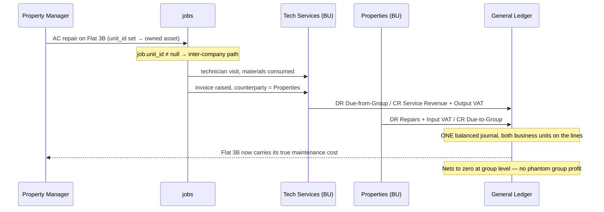

# 02 — Data model

85 tenant-scoped tables plus 5 global ones. Source of truth is
[`packages/db/src/schema/`](../packages/db/src/schema/); this document explains
the shape and the reasoning.

---

## Bounded contexts

```mermaid
graph TB
  subgraph Platform["Platform (global)"]
    U[users] --- S[sessions]
    P[permissions] --- RP[role_permissions] --- R[roles]
  end

  subgraph Tenancy
    T[tenants] --> BU[business_units] --> L[locations]
    BU --> BUM[business_unit_modules]
    T --> NS[number_series]
  end

  subgraph Identity
    M[memberships] --> MS[membership_scopes]
    AL[audit_log]
  end

  subgraph Parties["Parties — one record per human"]
    PA[parties] --> PBU[party_business_units]
    PA --> INT[interactions]
    PA --> LD[leads]
  end

  subgraph Catalog
    IT[items] --> IV[item_variants]
    IT --> IC[item_components]
    PL[price_lists] --> PLE[price_list_entries]
  end

  subgraph Inventory
    WH[warehouses] --> SL[stock_levels]
    SM[stock_moves] --> SL
    SU[serial_units]
  end

  subgraph Commerce["Documents — the commercial spine"]
    D[documents] --> DL[document_lines]
    PAY[payments] --> ALLOC[payment_allocations] --> D
    IP[installment_plans] --> INS[installments]
  end

  subgraph Accounting
    ACC[accounts] --> JL[journal_lines] --> J[journals]
    TC[tax_codes]
    BA[bank_accounts] --> BT[bank_transactions]
    CR[cash_registers] --> CRS[cash_register_sessions]
    PR[posting_rules]
  end

  subgraph Operations
    SITE[sites] --> UN[units] --> LE[leases] --> LC[lease_charges]
    SITE --> JOB[jobs] --> JV[job_visits]
    JOB --> JLN[job_lines]
    PRJ[projects] --> JOB
    RES[resources] --> APT[appointments] --> APS[appointment_services]
  end

  subgraph People
    EMP[employees] --> ATT[attendance]
    EMP --> CE[commission_entries]
    PRUN[payroll_runs] --> PS[payslips]
  end

  subgraph Intelligence
    KPI[kpi_snapshots]
    AI[ai_insights]
    AUT[automations] --> AR[automation_runs]
    DX[document_extractions]
  end

  U --> M --> T
  PA --> D
  D --> J
  PAY --> J
  JOB --> D
  LE --> D
  APT --> D
  UN -.owned unit serviced by own company.-> JOB
  IT --> DL
  SM --> J

  classDef spine fill:#4f46e5,stroke:#4f46e5,color:#fff
  class D,J,PA,IT spine
```

The four highlighted tables — `parties`, `items`, `documents`, `journals` — are
the spine. Almost every feature is a projection over them.

---

## The five unification decisions

Each one collapses what the brief described as separate things into a single
table. Together they are why this is 85 tables rather than ~200.

### 1. `parties` — customers, suppliers, tenants and staff are one table

In this portfolio the same human is routinely a salon customer, the tenant in flat
4B, and a subcontractor. Separate `customers`/`suppliers`/`tenants` tables make
that person three unrelated records — so the total relationship value is
unknowable and phone numbers duplicate forever.

Role flags (`is_customer`, `is_supplier`, `is_tenant_renter`, `is_employee_party`)
are non-exclusive. `party_business_units` carries the per-business relationship
and stats.

*Cost:* a party list needs a role filter, and "customer" validation rules are
conditional. Worth it.

### 2. `items` — products and services in one table

A haircut, an hour of AC servicing, a Samsung A55 and a monthly parking bay are
all "a line on an invoice with a price and a revenue account". `type` and
`tracking_mode` carry the difference. Splitting them duplicates the price list,
the POS grid, the tax logic and the commission engine.

### 3. `documents` — one table for seven document types

See [01-architecture §2](01-architecture.md).

### 4. `units` + `leases` — apartments and parking bays are the same thing

A parking bay is a space, let to a party, for a term, at a recurring charge, with
an occupancy rate and an overdue balance. `unit_kind` distinguishes them. One
occupancy metric covers both.

### 5. `jobs` — six trades, one work order

`service_kind` is a **free string**, not an enum, precisely so adding "pest
control" next year needs no migration.

---

## The one table that resists unification: `cheques`

Post-dated cheques could not be folded into `payments`, and the reason is
instructive. A cheque in the safe is:

- **not a payment** — no money has moved
- **not a receivable** — the invoice for the period it covers may not exist yet
- **not cash** — booking a year of rent cheques as cash overstates the bank
  balance by an entire year's rent

It is a *physical instrument with a lifecycle*: `held → deposited → cleared |
bounced → replaced`. Bounces carry a bank charge, a replacement chain and
sometimes a legal process, and in an Ejari or Rental Dispute Centre matter the
landlord must be able to prove which cheque covered which rental period.

Rent accrual stays independent and correct: invoices are still raised monthly, a
cleared cheque produces a `payment`, and that payment is allocated across the
invoices for the months the cheque covers. See
[05-uae-localisation](05-uae-localisation.md#2-post-dated-cheques-are-a-first-class-entity).

---

## Invariants enforced by the database

Business rules that must never be violated live in the database, not only in
application code. A service-layer bug must not be able to corrupt the ledger.

| Invariant | Mechanism |
|---|---|
| Every journal balances | Deferred constraint trigger `journal_balance_check` |
| A journal line is debit **or** credit, never both | `CHECK` constraint |
| One active lease per unit | Partial unique index `WHERE status = 'active'` |
| No double-booked chair | `EXCLUDE USING gist (resource_id WITH =, tstzrange(...) WITH &&)` |
| No cross-tenant read or write | RLS `USING` + `WITH CHECK` on all 85 tables |
| No tenant-created global roles | `WITH CHECK` excludes `tenant_id IS NULL` |
| Unique document numbers per business per type | Composite unique index |
| No duplicate cheque from the same bank | Unique index on (tenant, bank, cheque number) |
| Gratuity provision ties to per-employee accruals | Asserted in the E2E suite — ledger vs `employees` |

The exclusion constraint is worth highlighting: double-booking is made *impossible*
rather than merely discouraged by a check in the booking service.

---

## Inter-company flow

The feature that only matters because this owner runs several businesses.

Without this: the property looks more profitable than it is, the service company
looks under-utilised, and the true yield on Flat 3B is unknowable.

---

## Money and quantities

| Concern | Decision |
|---|---|
| Amounts | `numeric(18,4)` — 4 dp because unit prices, FX and % commission round badly at 2 |
| Rates | `numeric(9,6)` as a fraction (`0.15` = 15%) |
| Currency | Code on the document; `fx_rate` + `base_*` columns on every ledger line |
| Rounding | At presentation and posting only, never in storage |
| Driver | Numerics returned as **strings**; no implicit coercion to JS float |

---

## Indexing

- Every tenant-scoped table has a leading `tenant_id` index — RLS policy columns
  must be indexed or every check is a sequential scan.
- Composite indexes follow real access patterns: `(tenant, doc_type, issue_date)`,
  `(tenant, direction, status, due_date)` for ageing, `(employee, scheduled_start)`
  for dispatch.
- `pg_trgm` GIN indexes on party and item search — "find the customer by half a
  phone number" is the single most-used interaction in a shop.
- UUIDv7 primary keys generated in application code: time-ordered, so inserts
  append to the right edge of the B-tree instead of scattering. With v4, a
  few-million-row invoice table turns every insert into a random page write.

---

## Table census

| Context | Tables |
|---|---|
| Tenancy | 6 |
| Identity & access | 7 |
| Parties / CRM | 5 |
| Catalogue | 6 |
| Inventory | 7 |
| Documents & payments | 6 |
| Accounting | 12 |
| Operations (rentals, field service, appointments) | 17 |
| People | 8 |
| Commerce, marketing, automation, AI | 16 |
| **Total** | **90** (85 tenant-scoped + 5 global) |
