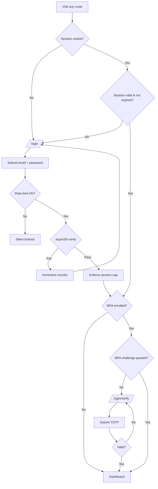
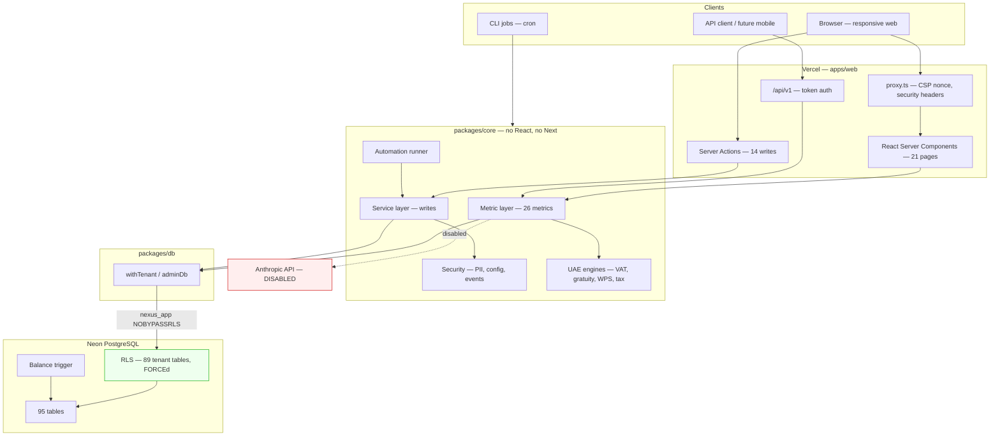
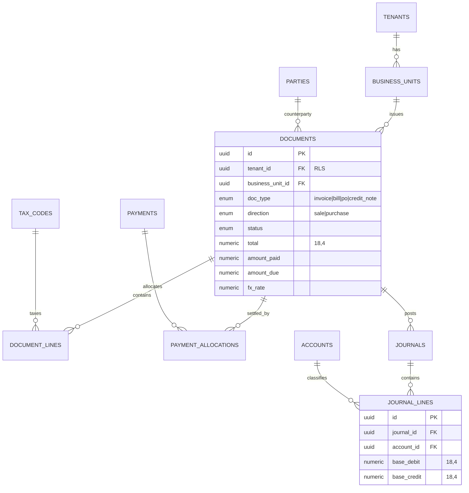
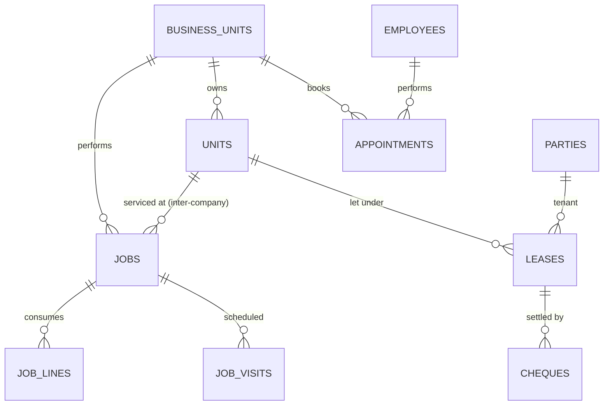

# Nexus ERP — Product & Technical Master Document

**Status:** Reverse-engineered audit · **Date:** 2026-08-09 · **Version:** 1.0
**Audit basis:** 107 source files / ~25,600 lines, 95 database tables, 24 routes, 227 automated checks, one live deployment.

> **What this document is.** The product, design and engineering documentation
> that should have existed *before* development began, reconstructed from the
> code that exists now. It is intended to become the single source of truth.
>
> **What this document is not.** A description of the code. Where the
> implementation embeds a decision nobody consciously made, this document names
> it as such rather than presenting it as a requirement.

### Labelling convention used throughout

| Tag | Meaning |
|---|---|
| **[INFERRED REQUIREMENT]** | Not stated by the user; deduced from the implementation. Needs ratification. |
| **[IMPLICIT DECISION]** | Decided by writing code, not by deciding. May be right, but was never chosen. |
| **[UNKNOWN / NEEDS CONFIRMATION]** | Genuinely unresolved. Do not build on this until answered. |
| **[EXPLICIT]** | Directly stated by the user in the build conversation. |

---

## Table of contents

| # | Section |
|---|---|
| 1 | [Executive Summary](#1-executive-summary) |
| 2 | [Product Overview](#2-product-overview) |
| 3 | [Problem & Opportunity](#3-problem--opportunity) |
| 4 | [Target Users & Personas](#4-target-users--personas) |
| 5 | [Product Vision & Goals](#5-product-vision--goals) |
| 6 | [Current Product Analysis](#6-current-product-analysis) |
| 7 | [Product Requirements Document](#7-product-requirements-document) |
| 8 | [User Stories](#8-user-stories) |
| 9 | [Feature Specification](#9-feature-specification) |
| 10 | [User Flows](#10-user-flows) |
| 11 | [Product Design Document](#11-product-design-document) |
| 12 | [Information Architecture](#12-information-architecture) |
| 13 | [UX/UI Specification](#13-uxui-specification) |
| 14 | [Technical Requirements Document](#14-technical-requirements-document) |
| 15 | [System Architecture](#15-system-architecture) |
| 16 | [Database Architecture](#16-database-architecture) |
| 17 | [API Architecture](#17-api-architecture) |
| 18 | [Security Architecture](#18-security-architecture) |
| 19 | [Technical Design Document](#19-technical-design-document) |
| 20 | [Testing Strategy](#20-testing-strategy) |
| 21 | [Analytics & Observability](#21-analytics--observability) |
| 22 | [Current vs Ideal State](#22-current-vs-ideal-state) |
| 23 | [Product Debt](#23-product-debt) |
| 24 | [Technical Debt](#24-technical-debt) |
| 25 | [Risk Register](#25-risk-register) |
| 26 | [Requirement Traceability Matrix](#26-requirement-traceability-matrix) |
| 27 | [Product Backlog](#27-product-backlog) |
| 28 | [Development Roadmap](#28-development-roadmap) |
| 29 | [Recommended Improvements](#29-recommended-improvements) |
| 30 | [What We Should Have Done Before Coding](#30-what-we-should-have-done-before-coding) |
| 31 | [Final Executive Assessment](#31-final-executive-assessment) |

---

# 1. Executive Summary

Nexus is a **multi-business operating system for a single owner-operator group in
Dubai**. One person owns a salon, a mobile-phone shop, an e-commerce channel,
residential apartments, parking bays, and a field-services arm (plumbing,
electrical, AC, handyman, cleaning, construction-maintenance). Before Nexus,
each of those is a separate spreadsheet, a separate cash box, and a separate
mental model. Nexus puts them on **one ledger, one customer list, one dashboard**.

**What exists today is a strong foundation with a narrow proven core and a wide
unproven perimeter.** Specifically:

- The **financial core is genuinely production-grade**: double-entry with a
  database-enforced balance trigger, 28,106 journal lines, zero unbalanced, and
  a transactional write layer that is idempotent, permission-checked and audited.
- The **tenant-isolation model is unusually rigorous** for a project this age:
  RLS generated from the schema, `FORCE`d, running as a `NOBYPASSRLS` role,
  verified by tests that attempt cross-tenant reads *and* writes.
- The **UAE localisation is real, not cosmetic**: VAT input apportionment for
  exempt residential rent, post-dated cheque lifecycle, gratuity on basic salary,
  WPS SIF export, corporate tax with Small Business Relief.
- Against that, **verification is shallow where it matters most**. There is no
  unit-test framework at all. The 227 checks are bespoke scripts that assert
  end-to-end behaviour; the pure functions that compute gratuity, VAT and
  corporate tax — the ones that produce legally consequential numbers — have no
  isolated tests with hand-calculated fixtures.
- **The product has never met a user.** No user research was done, no adoption
  has been measured, and the entire dataset is synthetic. Every product claim in
  this document is inferred from code and from one requirements conversation.

**Maturity verdict: a well-engineered demo, not a deployed business system.**
The architecture is good enough to carry real books. The product is not yet
validated enough to justify migrating real books onto it.

**Three things must be fixed before real data enters the system:** money
arithmetic in JavaScript floats, the absence of unit tests on the tax and
gratuity engines, and the absence of any error boundary or observability. These
are detailed in §24 and sequenced in §28 Phase 0.

---

# 2. Product Overview

| | |
|---|---|
| **Product name** | Nexus |
| **Category** | Vertical ERP / SMB business-operations platform |
| **Deployment model** | Single-tenant web app today; multi-tenant SaaS-capable architecture |
| **Jurisdiction** | United Arab Emirates — Dubai **[EXPLICIT]** |
| **Currency** | AED, base currency configurable per tenant |
| **Primary surface** | Responsive web (mobile-first) |
| **Secondary surface** | Token-authenticated read API (`/api/v1`) |
| **Live URL** | `https://unified-business-dashboard-erp.vercel.app` (demo data) |
| **Repository** | `github.com/jmmohiuddin/Unified-Business-Dashboard-ERP` (public) |

### Product One-Liner

> **Nexus is the single dashboard, ledger and customer list for an owner who runs
> six different businesses and is currently running all of them from memory.**

### Product Vision

A portfolio owner should be able to answer *"how is my money doing?"* in one
place, in ten seconds, with numbers they trust enough to act on — regardless of
how many unrelated businesses produced them.

### Product Mission

Collapse a multi-business owner's fragmented operational reality into one
consistent, auditable, UAE-compliant system of record — and then let automation
and AI do the routine work of watching it.

### Value Proposition

| For | Who | Nexus is | That | Unlike | Because |
|---|---|---|---|---|---|
| A Dubai multi-business owner | juggling 6+ unrelated operations across spreadsheets, WhatsApp and cash books | a unified operating system | shows consolidated cash, profit and compliance across all businesses on one screen | Zoho/Odoo (generic, per-company silos) or separate point tools | it treats the *portfolio* as the primary entity, and models UAE tax law as a first-class concern rather than a locale file |

### Target Audience

**Primary:** the owner of a Dubai SME group with 5–15 business units, AED 5–50M
annual turnover, 20–150 staff, currently VAT-registered and approaching or
inside corporate-tax scope.

**Secondary:** their accountant, their general manager, and their operational
staff (barbers, technicians, receptionists, warehouse).

### Core Problem Statement

> A multi-business owner cannot see their true financial position, because each
> business keeps its own records in its own format, inter-company work is never
> recorded, and UAE tax treatment differs by business line — so the consolidated
> number either does not exist or is wrong.

---

# 3. Problem & Opportunity

## 3.1 The problem, decomposed

| # | Problem | Evidence in the build | Severity |
|---|---|---|---|
| P1 | **No consolidated view.** Six businesses, six record-keeping systems, no group P&L. | Entire `business_units` + consolidated-metric design exists to solve this | Critical |
| P2 | **Inter-company work is invisible.** When the owner's AC company services the owner's rental flat, nobody invoices anybody, so the property looks more profitable than it is and the AC company looks less busy. | Explicitly modelled: one balanced journal, revenue for one BU, cost for the other, nets to zero at group level | Critical |
| P3 | **UAE tax treatment differs per business line.** Residential rent is VAT-**exempt**; parking is standard-rated. Input VAT must be apportioned; getting it wrong produces confidently incorrect filings. | `vat_return_position` metric implements apportionment; `packages/core/src/uae/` isolates the rules | Critical |
| P4 | **Cash is settled in post-dated cheques.** PDCs are neither cash nor receivables and need their own lifecycle. | `cheques` table + 113-cheque register + `cheque_pipeline` metric | High |
| P5 | **Gratuity is an unfunded, invisible liability.** Accrues daily on *basic* salary only. | `gratuity_liability` metric = AED 160,353; pay stored as components | High |
| P6 | **Routine watching is manual.** Overdue debt, expiring leases, bouncing cheques, expiring visas — all require someone to remember to look. | 10-rule automation engine + notifications inbox | Medium |
| P7 | **Compliance deadlines are remembered, not tracked.** Trade licence, Ejari, visa expiry, VAT filing. | `compliance_watchlist` metric | High |

## 3.2 Existing alternatives, and why they were judged insufficient

**[INFERRED REQUIREMENT]** — no competitive analysis was performed during the
build. This is reconstructed reasoning, and should be validated before it is
used to justify further investment.

| Alternative | Why it partially works | Why it was rejected |
|---|---|---|
| **Zoho Books / QuickBooks** | Cheap, UAE VAT-aware, accountant-friendly | Company-per-entity. Consolidation is an export-and-merge exercise. No operational layer (appointments, jobs, leases). |
| **Odoo** | Genuinely multi-company, modular, has the operational apps | Heavy, expensive to customise, generic. UAE specifics (PDC lifecycle, gratuity on basic, WPS SIF) are add-ons of varying quality. |
| **Separate point tools** (Fresha for salon, a property app, a field-service app) | Each is best-in-class for its niche | Six subscriptions, six customer lists, zero consolidation, no inter-company. This is effectively the status quo. |
| **Spreadsheets** | Free, infinitely flexible, already understood | No audit trail, no concurrency, no permissions, breaks at scale, and is the current source of the problem. |

**The wedge:** none of the above treats *the portfolio* as the primary object,
and none models inter-company self-service as a normal flow. That is Nexus's
defensible position — and it is narrow. **[UNKNOWN / NEEDS CONFIRMATION]**
Whether that wedge is worth more than the cost of not using Odoo has never been
tested with the owner.

## 3.3 Opportunity sizing

**[UNKNOWN / NEEDS CONFIRMATION]** — entirely unquantified. No TAM, no willingness
to pay, no comparison against the cost of the tools being replaced. If Nexus is
ever intended to become the SaaS product that Phase 5 of the roadmap describes,
this is the single largest unknown in the project and must be answered before
that phase is funded.

---

# 4. Target Users & Personas

Sixteen roles are implemented with 122 distinct permissions. That role list is
itself **[INFERRED REQUIREMENT]** — it was derived from the business types, not
from interviewing anyone who holds these jobs.

### Implemented role hierarchy (from the live database)

| Role | Permissions | Scope | Persona below |
|---|---|---|---|
| `super_admin` | 122 | Platform | — |
| `owner` | 122 | Tenant | **P1 — Sumon** |
| `general_manager` | 85 | Tenant | **P2 — Rashid** |
| `salon_manager` | 47 | Business unit | secondary |
| `branch_manager` | 44 | Business unit | secondary |
| `accountant` | 41 | Tenant | **P3 — Priya** |
| `property_manager` | 25 | Business unit | secondary |
| `sales_staff` | 19 | Business unit | — |
| `auditor` | 19 | Tenant (read-only) | **P5 — external** |
| `customer_support` | 18 | Tenant | — |
| `receptionist` | 17 | Location | **P4 — Maya** |
| `marketing_manager` | 17 | Tenant | — |
| `hr` | 16 | Tenant | — |
| `warehouse_manager` | 16 | Business unit | — |
| `maintenance_staff` | 9 | Self | **P6 — Kamal** |
| `barber` | 5 | Self | **P7 — Ali** |

---

### P1 — Sumon · The Owner *(primary persona)*

| | |
|---|---|
| **Role** | Owns and directs all business units |
| **Context** | Moves between sites daily. Makes decisions from a phone, in transit, often between meetings. |
| **Goals** | Know the true consolidated position. Catch problems before they cost money. Spend less time collecting information and more time acting on it. |
| **Pain points** | Every number requires asking someone. Numbers arrive late and disagree. Cannot tell which business is actually subsidising which. |
| **Behaviours** | Checks in bursts, early morning and late evening. Skims, does not study. Trusts a number only if he can see where it came from. |
| **Needs** | Consolidated cash and profit; a short list of things that need him today; the ability to drill from a headline number to the underlying rows. |
| **Technical comfort** | Moderate. Fluent with WhatsApp and banking apps. Will not tolerate a system that requires training to read. |
| **Expectations** | Open app → understand position in under 10 seconds. |

**Design consequence:** the dashboard leads with KPI tiles and an action list, is
mobile-first, and every AI or metric figure links to its evidence.

---

### P2 — Rashid · General Manager

| | |
|---|---|
| **Role** | Runs day-to-day operations across units on the owner's behalf |
| **Goals** | Keep jobs on SLA, keep units occupied, keep staff productive |
| **Pain points** | Firefights by phone; has no single queue of what is slipping |
| **Needs** | Cross-unit operational view, exception lists, ability to act without escalating |
| **Technical comfort** | High |
| **Expectations** | Sees everything the owner sees except payroll-level compensation detail (85 of 122 permissions) |

---

### P3 — Priya · Accountant

| | |
|---|---|
| **Role** | Books, VAT returns, payroll, corporate tax, audit liaison |
| **Goals** | File correctly and on time; produce numbers that survive an FTA review |
| **Pain points** | Chasing source documents; reconciling inter-company; apportioning input VAT across exempt and standard-rated supplies |
| **Needs** | Trial balance that ties, VAT201 with a defensible apportionment, immutable audit trail, period locking |
| **Technical comfort** | High for accounting tools, low tolerance for ambiguity |
| **Expectations** | Every figure traceable to a journal; nothing ever hard-deleted |

**Design consequence:** soft deletes throughout, reversal-not-deletion for credit
notes, `assertPeriodOpen` on postings, append-only audit log.

---

### P4 — Maya · Receptionist (salon)

| | |
|---|---|
| **Role** | Books appointments, takes walk-ins, handles payment at the chair |
| **Goals** | Serve the queue without making the customer wait on software |
| **Pain points** | Slow forms; being blocked by a system that wants data she does not have |
| **Needs** | Fast booking, walk-in without a customer record, POS in a few taps |
| **Technical comfort** | Low–moderate |
| **Expectations** | Never sees revenue figures (17 permissions, location-scoped) |

---

### P5 — External Auditor

Read-only, tenant-wide, 19 permissions. Needs evidence, not editing.

---

### P6 — Kamal · Field Technician

| | |
|---|---|
| **Role** | Executes plumbing/AC/electrical jobs on site |
| **Goals** | Get the job list, do the work, record it, go home |
| **Pain points** | Poor connectivity in basements and new-build sites; typing on a phone with gloves |
| **Needs** | **Offline-first job completion**, photo capture, ≤3 taps to complete |
| **Technical comfort** | Low |
| **Expectations** | Self-scoped: sees only his own jobs (9 permissions) |

> ⚠️ **The technician experience does not exist yet.** The data model supports it
> fully (jobs, visits, lines, photos, van stock as warehouses); there is no mobile
> app and no offline sync. This is the largest gap between what the schema
> promises and what a user can do — see §23 PD-01.

---

### P7 — Ali · Barber

Self-scoped, 5 permissions. Verified by test to see only the salon and to be
denied revenue figures. Needs his own schedule and his own commission — the
latter is computed but has **no screen**.

---

## 4.1 Jobs-to-be-done

| # | When… | I want to… | So I can… | Served today? |
|---|---|---|---|---|
| J1 | I wake up | see whether anything went wrong overnight | act before it compounds | ✅ Dashboard + briefing |
| J2 | I consider a new venture | know which existing business actually makes money | allocate capital honestly | ⚠️ Partial — no per-BU capital view |
| J3 | A tenant's cheque is due | know whether it cleared | chase before it bounces | ✅ Cheque register |
| J4 | VAT filing approaches | produce a correct return including exempt apportionment | avoid FTA penalties | ✅ VAT201 screen |
| J5 | An employee resigns | know the exact gratuity owed | pay correctly and immediately | ✅ Gratuity metric |
| J6 | A technician finishes a job | capture it at the site | invoice same-day instead of next-week | ❌ **No mobile app** |
| J7 | I want to know something unusual | ask in plain language | avoid waiting for a report | ⚠️ **Built but disabled** |
| J8 | Stock runs low | reorder before stockout | not lose the sale | ✅ Low-stock metric + reorder ranking |
| J9 | Month ends | close the books | file and move on | ❌ **No close/lock workflow UI** |

---

# 5. Product Vision & Goals

## 5.1 Business goals

| # | Goal | Metric | Target | Status |
|---|---|---|---|---|
| B1 | Replace fragmented record-keeping in the owner's group | Businesses fully operating in Nexus | 6 of 6 | **0 of 6** — no real data migrated |
| B2 | Eliminate the consolidation delay | Time to consolidated position | < 10 s | ✅ ~150 ms metric sweep |
| B3 | Avoid UAE compliance penalties | Late/incorrect filings | 0 | Untested against a real filing |
| B4 | Recover inter-company margin visibility | Inter-company flows recorded | 100% | ✅ Modelled, untested with real work |
| B5 | *(Aspirational)* become a sellable SaaS | Paying tenants | — | **[UNKNOWN / NEEDS CONFIRMATION]** Not validated |

## 5.2 Product goals

| # | Goal | Status |
|---|---|---|
| PG1 | One dashboard covering every business | ✅ |
| PG2 | One ledger, always balanced | ✅ DB-enforced |
| PG3 | One customer list across businesses | ✅ `parties` + cross-business metric |
| PG4 | UAE rules correct by construction | ✅ Isolated in `uae/`, ⚠️ untested in isolation |
| PG5 | Mobile-first for the owner | ✅ Web responsive · ❌ no native/offline |
| PG6 | Automation that acts, not just records | ⚠️ Engine built, dry-run only, no delivery provider |
| PG7 | AI that cannot lie about numbers | ✅ Architecturally · ❌ **currently switched off** |

## 5.3 Success criteria

**[INFERRED REQUIREMENT]** — none of these were defined before the build; they
are proposed here for ratification.

| Horizon | Criterion |
|---|---|
| **Foundation (now)** | All 227 checks green; ledger balances; cross-tenant isolation proven |
| **Adoption (Phase 1)** | One business runs 14 consecutive days with **no parallel paper record** — this is the only honest adoption test |
| **Trust (Phase 1)** | Migrated trial balance matches the accountant's figure to the fils |
| **Leverage (Phase 3)** | ≥ 50% of owner's "what's happening" questions answered without asking a human |
| **Scale (Phase 5)** | New tenant self-provisions to a working dashboard in < 10 minutes |

---

# 6. Current Product Analysis

## 6.1 What is actually built — verified inventory

| Layer | Count | Detail |
|---|---|---|
| Database tables | **95** | 89 tenant-scoped (RLS-enforced) + 6 global |
| Indexes | 355 | incl. a `tenant_id` index per RLS'd table |
| Foreign keys | 264 | |
| CHECK constraints | 1,426 | mostly enum domains |
| Triggers | 3 | incl. journal balance enforcement |
| Bounded contexts | 10 | accounting, documents, operations, platform, hr, identity, inventory, catalog, parties, tenancy |
| Metrics | 26 | typed, permission-checked |
| Roles | 16 | 122 permissions across 26 groups |
| Routes | 24 | 21 pages + 3 API |
| Server actions | 14 | |
| UI primitives | 10 | Card, CardHeader, Delta, KpiTile, Sparkline, BarRow, Chip, EmptyState, TileSkeleton, GridSkeleton |
| Automated checks | 227 | 26 metric · 35 write · 98 e2e · 68 security |
| Seed volume | — | 1 tenant, 7 BUs, 9 users, 447 parties, 4,151 documents, 28,106 journal lines, 2,199 appointments, 41 leases |

> **📌 Documentation inconsistency found.** `README.md` claims *"94 tables — 88
> tenant-isolated + 6 global"*. The database contains **95 tables, 89 of them
> RLS-secured**. The README is stale by one table. Filed as TD-11.

## 6.2 Feature completeness matrix

Legend: ✅ complete · ⚠️ partial · ❌ absent

| Domain | Schema | Metrics | Read UI | Write UI | API | Tests |
|---|---|---|---|---|---|---|
| Consolidated dashboard | ✅ | ✅ | ✅ | n/a | ✅ | ✅ |
| Receivables & payments | ✅ | ✅ | ✅ | ✅ | ✅ | ✅ |
| Payables & purchasing | ✅ | ✅ | ✅ | ✅ | ✅ | ✅ |
| Credit notes / refunds | ✅ | — | ✅ | ✅ | ✅ | ✅ |
| Rentals & leases | ✅ | ✅ | ✅ | ❌ | ✅ | ⚠️ read-only |
| Post-dated cheques | ✅ | ✅ | ✅ | ✅ | ✅ | ✅ |
| Salon / appointments | ✅ | ✅ | ✅ | ✅ | ✅ | ✅ |
| Field service jobs | ✅ | ✅ | ✅ | ✅ | ✅ | ✅ |
| Inventory & stock | ✅ | ✅ | ✅ | ⚠️ counts only | ✅ | ✅ |
| CRM | ✅ | ✅ | ✅ | ❌ | ✅ | ⚠️ |
| VAT201 | ✅ | ✅ | ✅ | ❌ no filing | ✅ | ⚠️ no unit tests |
| P&L | ✅ | ✅ | ✅ | n/a | ✅ | ⚠️ |
| Gratuity | ✅ | ✅ | ✅ | ❌ no payout | ✅ | ⚠️ no unit tests |
| WPS payroll | ✅ | — | ⚠️ export only | ❌ no payroll run | ✅ | ⚠️ |
| Corporate tax | ✅ | ✅ | ⚠️ | ❌ | ✅ | ⚠️ no unit tests |
| Compliance watchlist | ✅ | ✅ | ✅ | ❌ | ✅ | ✅ |
| Notifications | ✅ | — | ✅ | ✅ | ❌ | ✅ |
| Automation engine | ✅ | — | ❌ **no UI** | ❌ | ❌ | ⚠️ CLI only |
| Outbound messaging | ✅ | — | ❌ | ❌ | ❌ | ⚠️ no provider |
| AI assistant | ✅ | ✅ | 🔴 **disabled** | — | ❌ | ❌ removed |
| E-commerce | ✅ | ✅ | ❌ placeholder | ❌ | ✅ | ❌ |
| Construction/projects | ✅ | ❌ | ❌ | ❌ | ❌ | ❌ |
| Security & MFA | ✅ | — | ✅ | ✅ | n/a | ✅ 68 checks |

**Read/write asymmetry is the defining shape of this product.** Nearly everything
can be *seen*; roughly half can be *changed*. For an ERP — a system of record
whose purpose is capturing transactions — that is backwards. A dashboard over
data nobody can enter is a report, not an ERP.

## 6.3 Decisions that were made implicitly

| # | Decision | How it was made | Verdict |
|---|---|---|---|
| **ID-01** | Eleven businesses collapsed into five domains | Engineering judgement during schema design | **Correct and valuable.** Removed ~60% of build surface. Should have been a documented product decision with owner sign-off. |
| **ID-02** | Parking modelled as a rentable unit with a lease, identical to an apartment | Schema design | Correct. But parking is standard-rated VAT while residential rent is exempt — the shared model makes that distinction easy to get wrong. Currently handled; needs a regression test. |
| **ID-03** | Polymorphic `documents` table (invoice/bill/PO/credit-note via `doc_type` + `direction`) | Emerged while building payables | **Strong.** Made payables a mirror of receivables. Never consciously chosen. |
| **ID-04** | Money as `numeric(18,4)` in DB but **IEEE-754 doubles in JavaScript** | Never decided | **Dangerous.** See TD-01. |
| **ID-05** | 16 roles / 122 permissions | Derived from business types | Over-engineered for one owner with 9 users. Correct for SaaS; premature now. |
| **ID-06** | `force-dynamic` on all 21 pages, no caching | Default while building | **Cost decision made by accident.** Every page load hits the DB. See TD-04. |
| **ID-07** | No unit-test framework; bespoke check scripts instead | Momentum | **Wrong.** See TD-02. |
| **ID-08** | English-only, LTR-only | Never considered | Questionable in the UAE. See PD-05. |
| **ID-09** | AI limited to a semantic metric layer, no SQL generation | Deliberate, evidence-based | **Excellent.** Best decision in the codebase. |
| **ID-10** | Soft deletes everywhere; reversal not deletion | Accounting instinct | Correct and legally necessary. |
| **ID-11** | Catch-all `[...slug]` "honest placeholder" page | Deliberate anti-fake-demo stance | Good intent, now **7/8 entries are dead code**. See TD-08. |
| **ID-12** | Public API exposes reads only | Scope ran out | Reasonable, but leaves the mobile story unbuildable. |

---

# 7. Product Requirements Document

## 7.1 Executive summary

Nexus is a unified operating system for a Dubai multi-business owner. It replaces
per-business spreadsheets with one double-entry ledger, one customer list, and
one consolidated dashboard, with UAE tax and labour rules modelled as first-class
domain logic. This PRD documents the requirements the system *should* have been
built against, reconstructed from the implementation.

## 7.2 Product overview

See §2.

## 7.3 Problem statement

See §3.

## 7.4 Goals

See §5. Summarised:
- **Business:** one system of record for the whole group; no compliance penalties.
- **Product:** consolidated truth in under ten seconds, drillable to source rows.
- **User:** the owner stops asking people for numbers; staff stop keeping parallel paper.

## 7.5 Non-goals

Explicitly out of scope. This list did not exist during the build and is a
significant part of why scope wandered.

| # | Non-goal | Rationale |
|---|---|---|
| NG1 | **Not a general-purpose accounting package.** | It serves this portfolio's shape. It will not compete with Zoho on breadth. |
| NG2 | **Not a replacement for the accountant.** | It produces defensible numbers; a human still files. |
| NG3 | **Not a customer-facing storefront.** | E-commerce means *channel order sync*, not a shopfront. |
| NG4 | **No payroll disbursement.** | WPS SIF export only; the bank moves money. |
| NG5 | **No direct FTA e-filing** in the near term. | Produce the return; a human submits. |
| NG6 | **Not multi-jurisdiction yet.** | UAE only. A second country is a sibling directory, not a config flag. |
| NG7 | **No LLM-generated SQL, ever.** | Architectural commitment; accuracy and isolation both depend on it. |
| NG8 | **No offline web.** | Offline is a *native mobile* concern for technicians only. |

## 7.6 Target users

See §4.

## 7.7 User stories

See §8.

## 7.8 Functional requirements

See §9.

## 7.9 Feature prioritisation (MoSCoW)

Assessed against the actual goal: **one owner running six real businesses.**

### Must have — without these the product does not do its job

| Feature | Status | Why must-have |
|---|---|---|
| Consolidated dashboard | ✅ | The entire value proposition |
| Double-entry ledger, always balanced | ✅ | Everything else is derived from it |
| Tenant isolation | ✅ | Non-negotiable if it ever hosts a second tenant |
| Invoicing + payment capture | ✅ | Money in |
| Supplier bills + payment | ✅ | Money out |
| VAT201 with exempt apportionment | ✅ | Legal obligation |
| Authentication + RBAC | ✅ | 9 users of differing trust |
| Audit trail | ✅ | FTA and auditor requirement |
| **Data migration / import** | ❌ **MISSING** | **Without it, no real data can enter. This is the #1 blocker.** |
| **Month-end close & period lock UI** | ❌ **MISSING** | Books that cannot be closed cannot be filed |
| **Unit tests on tax/gratuity engines** | ❌ **MISSING** | These produce legally consequential numbers |

### Should have

| Feature | Status |
|---|---|
| Rent run (bulk monthly invoicing) | ❌ — highest cash ROI per unit of work |
| Cheque lifecycle | ✅ |
| Gratuity liability | ✅ |
| Stock counts | ✅ |
| Credit notes | ✅ |
| Notifications inbox | ✅ |
| MFA | ✅ |
| Error boundaries & loading states | ❌ |
| Observability | ❌ |

### Could have

Technician mobile app · AI assistant (built, disabled) · automation delivery
(Twilio/Unifonic) · commission statements · dispatch board · e-commerce channel
sync · public write API.

### Won't have yet

Native owner app (responsive web suffices) · FTA e-filing · multi-jurisdiction ·
SSO/SAML · white-label SaaS · advanced BI.

## 7.10 Acceptance criteria (representative)

**AC-1 — Record a customer payment**
```gherkin
Given an invoice with AED 5,000 outstanding
  And I hold the "payment:create" permission
 When I record a payment of AED 3,000 allocated to that invoice
 Then a balanced journal is posted (DR Cash 3,000 / CR AR 3,000)
  And the invoice shows amount_due = 2,000 and status = "partial"
  And an audit entry records actor, timestamp and before/after
  And replaying the same idempotency key does NOT double-post
```

**AC-2 — Over-allocation is refused**
```gherkin
Given an invoice with AED 1,000 outstanding
 When I attempt to allocate AED 1,500 to it
 Then the write is rejected with a clear message
  And no journal is posted
  And the transaction is rolled back in full
```

**AC-3 — Exempt-supply input VAT is not recovered**
```gherkin
Given the Properties business makes VAT-exempt residential-rent supplies
 When it receives a supplier bill carrying 5% input VAT
 Then that VAT is expensed, not posted to the recoverable input-VAT account
  And the VAT201 return excludes it from box "recoverable input tax"
```

**AC-4 — Cross-tenant access is impossible**
```gherkin
Given I am authenticated in tenant A
 When a query or write targets a row belonging to tenant B
 Then the read returns zero rows
  And the write is rejected by the database, not by application code
```

**AC-5 — Scoped user cannot see other businesses**
```gherkin
Given I am a barber scoped to the salon
 When I open the dashboard
 Then I see only salon data
  And revenue metrics are absent, not empty
```

## 7.11 User flows

See §10.

## 7.12 Edge cases missed during development

| # | Edge case | Current behaviour | Risk |
|---|---|---|---|
| EC-01 | Two users edit the same invoice simultaneously | Last write wins; no optimistic locking | Silent data loss |
| EC-02 | Payment in a currency ≠ base currency | `fx_rate` column exists, no UI, no rate feed | Wrong books if it ever happens |
| EC-03 | Cheque returned unpaid by the bank *after* being marked cleared | **Cannot be recorded at all.** The state machine allows `bounce` only from `held`/`deposited`, never from `cleared`. A real post-clearing return has no representation. | Operator must correct by hand outside the model |
| EC-04 | Lease renewal mid-VAT-period | Not modelled | Apportionment error |
| EC-05 | Employee rehired after gratuity paid | Service-date logic assumes continuous service | Over/under-accrual |
| EC-06 | Stock count for a variant when `variant_id IS NULL` | Handled (UPDATE-then-INSERT) after a bug | Fixed, but the NULL-unique-index trap remains elsewhere |
| EC-07 | Credit note exceeding original invoice | Capped at invoice total | ✅ Handled |
| EC-08 | Partial refund to a *different* payment method | Not modelled | Reconciliation gap |
| EC-09 | Timezone boundary — "today" at 00:30 GST vs UTC | `resolveToday` exists; not tested across DST/boundary | Metric drift |
| EC-10 | Removing a user's access | **No deactivation path exists in the product.** Requires a direct DB edit, which does not invalidate live sessions. | **Access after removal** |
| EC-11 | Journal posted into a closed period | `assertPeriodOpen` exists; no UI to close a period | Guard unreachable |
| EC-12 | Very large list (10k invoices) | **No pagination anywhere** | `/receivables` already renders 284 KB of HTML |

## 7.13 Non-functional requirements

| Category | Requirement | Current | Verdict |
|---|---|---|---|
| **Performance** | Dashboard < 500 ms | ~150 ms metric sweep | ✅ |
| | List pages bounded | No pagination; 284 KB `/receivables` | ❌ |
| **Scalability** | 1,000 concurrent tenants | Never load-tested; `force-dynamic` on all pages | ❌ Unknown |
| **Availability** | 99.5% | Vercel + Neon defaults; no SLO, no monitoring | ⚠️ Unmeasured |
| **Reliability** | No lost writes | Single transaction per action; DB-enforced invariants | ✅ Strong |
| **Security** | See §18 | argon2id, MFA, RLS, PII encryption, 68 checks | ✅ Strong |
| **Privacy** | PDPL-shaped erasure | Pseudonymisation retaining tax invoices | ✅ |
| **Accessibility** | WCAG 2.2 AA | 23 aria attrs, 5 labels, 0 alt, 0 tabIndex, no audit | ❌ Not met |
| **Maintainability** | Layers enforced | `core` imports no React/Next — genuinely clean | ✅ |
| **Observability** | Errors + traces | **None.** No Sentry/OTel. Event stream has no collector. | ❌ |
| **Compatibility** | Modern evergreen browsers | Untested outside dev | ⚠️ |
| **Localisation** | Arabic + RTL | **None.** English hardcoded. | ❌ |
| **Disaster recovery** | Tested restore | Encrypted backup + verified restore drill | ✅ Local disk only |

## 7.14 Success metrics

| Category | Metric | Instrumented? |
|---|---|---|
| Activation | Businesses with real data | ❌ |
| Adoption | DAU / WAU by role | ❌ |
| Retention | Days with no parallel paper record | ❌ |
| Engagement | Dashboard opens/day; drill-down rate | ❌ |
| Feature adoption | % payments recorded in-app vs after the fact | ❌ |
| Task completion | Booking success rate; time-to-invoice | ❌ |
| Quality | Unbalanced journals (must be 0) | ✅ via tests |
| Performance | p95 page load | ❌ |
| Error rate | 5xx per 1,000 requests | ❌ |
| Business | Overdue debt trend; occupancy; gratuity liability | ✅ as metrics, ❌ as tracked KPIs over time |

> **The product is almost entirely un-instrumented.** `kpi_snapshots` is populated
> once by the seed and read by no code path, so there is no live time series and
> no way to answer "is this getting better?".

---

# 8. User Stories

### Epic A — Consolidated visibility (Owner)

| ID | Story | Priority | Status |
|---|---|---|---|
| A1 | As an owner, I want one dashboard across all businesses, so that I stop asking people for numbers. | P0 | ✅ |
| A2 | As an owner, I want to drill from any headline number to its rows, so that I can trust it. | P0 | ✅ |
| A3 | As an owner, I want a per-business profit comparison, so that I know which subsidises which. | P0 | ✅ |
| A4 | As an owner, I want a short list of what needs me today, so that I act instead of browse. | P0 | ✅ Action items |
| A5 | As an owner, I want a daily briefing pushed to me, so that I do not have to open the app. | P1 | ⚠️ Composed; **no delivery channel** |
| A6 | As an owner, I want to ask questions in plain language, so that I get answers to things nobody built a report for. | P2 | 🔴 Built, **disabled** |
| A7 | As an owner, I want to see trends over time, so that I know if things are improving. | P1 | ❌ No historical snapshots |

### Epic B — Money in (Owner, Accountant, Sales)

| ID | Story | Priority | Status |
|---|---|---|---|
| B1 | As an accountant, I want to raise an invoice with correct VAT treatment per business line. | P0 | ✅ |
| B2 | As an accountant, I want to record a payment and allocate it across invoices. | P0 | ✅ |
| B3 | As an accountant, I want over-allocation refused. | P0 | ✅ |
| B4 | As an accountant, I want to issue a credit note that reverses revenue, VAT and COGS and restocks goods. | P0 | ✅ |
| B5 | As a property manager, I want to generate every monthly rent invoice in one action. | **P0** | ❌ **MISSING — highest-ROI gap** |
| B6 | As an accountant, I want to track post-dated cheques through their lifecycle. | P1 | ✅ |
| B7 | As an accountant, I want to record a cheque returned unpaid *after* it cleared. | P1 | ❌ **EC-03 — transition unreachable; no way to record it** |

### Epic C — Money out (Accountant, Warehouse)

| ID | Story | Priority | Status |
|---|---|---|---|
| C1 | As an accountant, I want to record a supplier bill that receives stock and posts input VAT. | P0 | ✅ |
| C2 | As an accountant, I want irrecoverable VAT expensed for exempt-supply businesses. | P0 | ✅ |
| C3 | As an accountant, I want to pay a bill without over-paying it. | P0 | ✅ |
| C4 | As a warehouse manager, I want to raise a purchase order and have it approved. | P1 | ⚠️ Create only, **no approval flow** |
| C5 | As a warehouse manager, I want to count stock and post the variance. | P1 | ✅ |
| C6 | As a warehouse manager, I want to transfer stock between warehouses. | P2 | ❌ |

### Epic D — Operations

| ID | Story | Priority | Status |
|---|---|---|---|
| D1 | As a receptionist, I want to book a chair in a few taps, including walk-ins with no customer record. | P0 | ✅ |
| D2 | As a barber, I want to see my own schedule and my own commission. | P1 | ⚠️ Schedule ✅, **commission has no screen** |
| D3 | As a GM, I want to raise and complete a service job. | P0 | ✅ |
| D4 | As a technician, I want to complete a job offline on site and have it sync. | **P0 for Kamal** | ❌ **No mobile app** |
| D5 | As a property manager, I want a unit board showing vacancy. | P1 | ✅ Read-only |
| D6 | As a property manager, I want to create and renew a lease. | P1 | ❌ **No write path** |

### Epic E — Compliance (Accountant, Owner)

| ID | Story | Priority | Status |
|---|---|---|---|
| E1 | As an accountant, I want a VAT201 with input apportionment across exempt and standard-rated supplies. | P0 | ✅ ⚠️ no unit tests |
| E2 | As an accountant, I want the gratuity liability on basic salary only. | P0 | ✅ ⚠️ no unit tests |
| E3 | As an accountant, I want a WPS SIF file for the bank. | P0 | ✅ export only |
| E4 | As an accountant, I want a corporate-tax estimate with Small Business Relief. | P1 | ✅ ⚠️ no unit tests |
| E5 | As an owner, I want warning before a trade licence, Ejari or visa expires. | P0 | ✅ metric ⚠️ no delivery |
| E6 | As an accountant, I want to close a period so nobody can post into it. | **P0** | ❌ **Guard exists, no UI** |
| E7 | As an auditor, I want read-only access to everything with an immutable trail. | P1 | ✅ |

### Epic F — Platform & trust

| ID | Story | Priority | Status |
|---|---|---|---|
| F1 | As any user, I want my session protected by MFA. | P0 | ✅ |
| F2 | As an owner, I want to sign out everywhere if I suspect compromise. | P1 | ✅ |
| F3 | As an owner, I want to import my existing books. | **P0** | ❌ **MISSING — blocks everything** |
| F4 | As an owner, I want the system to alert me automatically. | P1 | ⚠️ Rules run; **no channel connected** |
| F5 | As a developer, I want an API so a mobile app can be built. | P2 | ⚠️ **Read-only** |

---

# 9. Feature Specification

Detailed specification for the highest-consequence features.

---

## F-01 · Record a customer payment

| | |
|---|---|
| **Purpose** | Capture money received and settle it against outstanding invoices |
| **User** | Accountant, Owner, Sales staff |
| **Permission** | `payment:create` |
| **Preconditions** | Open accounting period; at least one outstanding document; authenticated session |

**Flow**
1. User opens `/receivables`, expands "Record a payment"
2. Enters amount, date, method, reference; allocates across one or more invoices
3. Submits → server action → `recordPayment` service
4. Single transaction: validate → check permission → check idempotency → post journal → update document balances → write audit
5. Revalidate `/receivables` and `/`

**Business rules**
- Allocation total must equal payment amount
- No allocation may exceed a document's `amount_due`
- Journal must balance or the DB trigger aborts the transaction
- Unallocated remainder is held as credit on account
- Documents reaching ≤ 0.01 outstanding are marked `paid`

**Validation:** zod schema at the service boundary; amount > 0; valid date; known method.

**Success:** invoice balance reduced; journal posted; audit written; UI shows confirmation.
**Failure:** whole transaction rolls back; typed `ServiceError` surfaces a human message.

**Edge cases:** over-allocation ✅ refused · duplicate submit ✅ idempotency key · zero amount ✅ rejected · **concurrent edit ❌ unhandled** · **foreign currency ❌ unmodelled**

**Dependencies:** `documents`, `payments`, `payment_allocations`, `journals`, `journal_lines`, `audit_log`, `idempotency_keys`

---

## F-02 · Receive a supplier bill with stock

| | |
|---|---|
| **Purpose** | Record money owed to a supplier and bring goods into stock at correct cost |
| **Permission** | `document:create` |

**Business rules**
- Posts `DR Inventory + DR Input VAT / CR Accounts Payable`
- Recomputes **moving-average cost** per item on receipt
- **If the receiving business makes exempt supplies** (residential rent), input VAT is **irrecoverable** and is expensed instead of posted to the recoverable account — the single most important UAE rule in the system
- Stock levels use UPDATE-then-INSERT, not `ON CONFLICT`, because a `NULL` `variant_id` defeats the unique index

**Edge cases:** NULL variant ✅ handled (was a bug) · negative quantity ❌ unvalidated at UI · **partial receipt ❌ not modelled** · **bill without PO ✅ allowed** (correct for this business)

---

## F-03 · VAT201 return with input apportionment

| | |
|---|---|
| **Purpose** | Produce a filing-ready UAE VAT return |
| **Permission** | `report:read` + `settings:read` |

**Business rules**
- Standard rate 5%; residential rent **exempt**; parking **standard-rated** despite sharing the `units`/`leases` model
- Input VAT apportioned between exempt and taxable supplies; the exempt share is not recoverable
- Output VAT from sales documents; input VAT from purchase documents

**Success:** a return the accountant can transcribe into the FTA portal.
**Failure modes not handled:** ❌ no reverse-charge on imported services · ❌ no adjustment/correction mechanism for a prior period · ❌ **no unit tests with hand-calculated fixtures**

> ⚠️ **This is the highest-risk feature in the product.** It produces a number
> submitted to a tax authority, and it is verified only by an end-to-end snapshot
> against synthetic seed data — never by an isolated test against a
> hand-calculated expected value.

---

## F-04 · Gratuity liability

**Rules:** accrues daily on **basic salary only** (hence pay stored as components); UAE thresholds by service length; unlimited-contract rules.
**Current:** AED 160,353 across the seeded workforce.
**Gaps:** ❌ no payout workflow · ❌ no unit tests · ❌ rehire/broken-service edge case (EC-05)

---

## F-05 · Post-dated cheque lifecycle

**States:** `held → deposited → cleared` · `held|deposited → bounced → replaced`
**Rules:** a PDC is neither cash nor a receivable until it clears; the register shows 113 cheques.
The state machine is guarded explicitly (`clear` only from `held`/`deposited`,
`bounce` only from `held`/`deposited`, `replace` only from `bounced`) with the
stated reasoning *"clearing an already-cleared cheque would double-count the
receipt"*. Bouncing posts the bank charge (`DR Cheque charges / CR Bank`).

**Assessment: the guard is correct and prevents the double-count bug.**

**Gap — EC-03 (revised):** because `bounce` is unreachable from `cleared`, a
cheque returned unpaid by the bank *after* clearing — which does happen in UAE
banking — **cannot be recorded at all**. The operator has no in-system path.
Severity **Medium** (missing representation), not a ledger-corruption bug.

---

## F-06 · Tenant isolation

**Mechanism:** PostgreSQL RLS, generated from the schema, `FORCE`d, app connects as `nexus_app` (`NOBYPASSRLS`), context set via `SET LOCAL` inside the transaction (`withTenant`).
**Verification:** cross-tenant read returns 0 rows; cross-tenant write rejected by the database.
**Build gate:** `npm run db:rls` fails if any `tenant_id` table lacks an enforced policy.
**Residual risk:** `adminDb()` (owner, `BYPASSRLS`) is used for bootstrap lookups in `api-auth.ts`. Necessary — the tenant is unknown until the token resolves — but it is the one path where isolation depends on application correctness rather than the database. Should be minimised and explicitly tested.

---

## F-07 · AI assistant *(built, currently disabled)*

**Design:** Claude is given exactly one capability — call the same 26 typed metric
functions the dashboard uses. No SQL, no table access, no filesystem.
**Rationale:** accuracy is a context problem, not a code-generation problem.
Permissions are enforced inside `runMetric`, so the assistant cannot surface
payroll to a receptionist.
**Current state:** 🔴 `/assistant` redirects to `/`; nav entry commented out; no
`ANTHROPIC_API_KEY` provisioned. `lib/assistant.ts` intact.
**Product question — [UNKNOWN / NEEDS CONFIRMATION]:** is this a priority at all?
It was built to a high standard and switched off within days. That is a scope
signal worth heeding.

---

# 10. User Flows

## 10.1 Authentication



## 10.2 Record a payment — sequence

```mermaid
sequenceDiagram
    actor U as Accountant
    participant UI as /receivables
    participant SA as Server Action
    participant SVC as core/services/payments
    participant DB as PostgreSQL (nexus_app)

    U->>UI: Enter amount + allocations
    UI->>SA: recordPaymentAction(FormData)
    SA->>SA: requireSession()
    SA->>SVC: recordPayment(ctx, input)
    SVC->>SVC: zod validate
    SVC->>SVC: requirePermission("payment:create")
    SVC->>DB: BEGIN; SET LOCAL app.tenant_id
    SVC->>DB: check idempotency key
    SVC->>DB: verify amount_due per document
    alt over-allocated
        SVC-->>SA: ServiceError
        DB->>DB: ROLLBACK
    else valid
        SVC->>DB: INSERT payment + allocations
        SVC->>DB: UPDATE document balances
        SVC->>DB: INSERT journal + lines
        DB->>DB: TRIGGER assert debits = credits
        SVC->>DB: INSERT audit_log
        DB->>DB: COMMIT
        SVC-->>SA: { ok: true }
    end
    SA->>UI: revalidatePath("/receivables", "/")
    UI-->>U: Updated balance
```

## 10.3 Owner morning routine (the core journey)

```
Open app → Dashboard
  ├─ KPI tiles: cash, revenue MTD, net profit, overdue debt
  ├─ Action items: what needs me today
  ├─ Notification bell: unread automation output
  └─ Drill into any tile → underlying rows → act
```

**Decision points:** any red tile → drill; any action item → resolve; unread bell → triage.
**Failure states:** ❌ no error boundary — a thrown error yields a generic Next.js error page · ❌ no loading state — the page blocks until every metric resolves.

## 10.4 Month-end close — **the flow that does not exist**

```
Reconcile → Review → Adjust → Lock period → File VAT → Report
```
`assertPeriodOpen` exists in the service layer. **No UI can close a period**, so
the guard can never fire. An accountant cannot complete their core monthly job in
this system. **P0 gap.**

---

# 11. Product Design Document

## 11.1 Design principles *(reverse-engineered from consistent choices)*

| # | Principle | Evidence |
|---|---|---|
| **D1** | **Density over decoration.** Numbers are the content. | Compact tiles, tabular figures, minimal chrome |
| **D2** | **Every number is drillable.** A figure you cannot verify is a liability. | Every KPI links to its rows; AI answers carry evidence chips |
| **D3** | **No fake screens.** | The `[...slug]` placeholder states what is built and which phase delivers the UI, rather than mocking a finished module |
| **D4** | **Mobile-first for the owner.** | Bottom nav on mobile, sidebar on desktop; safe-area insets |
| **D5** | **Role-truthful UI.** Absent, not empty. | A barber does not see a greyed-out revenue tile; it is not rendered |
| **D6** | **Progressive disclosure of writes.** | Write forms live inside collapsible `Disclosure` sections so read pages stay scannable |
| **D7** | **Tabular numerals everywhere.** | `.tnum` class so columns of money align |

## 11.2 Current design system

**Tokens** (CSS custom properties, light/dark via `prefers-color-scheme`):

| Group | Tokens |
|---|---|
| Surface | `--bg --surface --surface-2 --surface-3` |
| Text | `--text --text-muted --text-subtle --text-inverse` |
| Semantic | `--accent(+soft/hover/border) --positive(+soft) --negative(+soft) --caution(+soft)` |
| Business-unit colours | `--color-bu-{blue,cyan,violet,amber,orange,rose,lime,slate}` — one per business, used consistently to identify a BU |
| Type scale | `--text-2xs → --text-3xl` (8 steps) |
| Radius | `--radius-sm/md/lg/xl` |
| Elevation | `--shadow-card --shadow-pop` |
| Fonts | `--font-sans --font-mono` |

**Assessment:** genuinely coherent — a real token system, not ad-hoc values. The
per-business colour dimension is a thoughtful touch that makes multi-business
data readable at a glance.

**Weaknesses:**
- Extensive inline `style={{ }}` alongside Tailwind utilities — two styling
  systems in one codebase (TD-09)
- No focus-visible treatment defined in tokens
- No motion/transition tokens
- No documented contrast ratios; dark-mode contrast unverified

## 11.3 Component system

| Component | Exists | States handled | Gap |
|---|---|---|---|
| `Card` / `CardHeader` | ✅ | — | — |
| `KpiTile` | ✅ | value, delta, link | no error state |
| `Delta` | ✅ | pos/neg/neutral | — |
| `Sparkline` | ✅ | — | no empty state |
| `BarRow` | ✅ | — | — |
| `Chip` | ✅ | tone variants | — |
| `EmptyState` | ✅ | ✅ | — |
| `TileSkeleton` / `GridSkeleton` | ✅ | loading | **never used** — no `loading.tsx` exists |
| `ActionForm` | ✅ | pending, ok, error | — |
| **Button** | ❌ | — | `.btn` CSS class, not a component — inconsistent usage |
| **Input / Select / Field** | ❌ | — | inline styles repeated across forms |
| **Table** | ❌ | — | hand-rolled per page |
| **Modal / Dialog** | ❌ | — | none |
| **Toast** | ❌ | — | feedback is inline only |
| **Pagination** | ❌ | — | **no list is paginated** |
| **Tabs / Filters** | ⚠️ | — | query-param links, not a component |

> **The skeleton components are the tell.** They were built, and then never used,
> because no `loading.tsx` was ever added. That is a UX decision made by omission.

## 11.4 Screen inventory

| Screen | Purpose | Primary user | Primary action | Empty | Loading | Error |
|---|---|---|---|---|---|---|
| `/` Dashboard | Consolidated position | Owner | Drill into a tile | ⚠️ | ❌ | ❌ |
| `/businesses` | Per-BU comparison | Owner | Compare | ⚠️ | ❌ | ❌ |
| `/receivables` | Money owed in | Accountant | Record payment | ✅ | ❌ | ❌ |
| `/purchases` | Money owed out | Accountant | Record bill | ✅ | ❌ | ❌ |
| `/rentals` | Unit & lease board | Property mgr | *(read only)* | ✅ | ❌ | ❌ |
| `/rentals/cheques` | PDC register | Accountant | Transition cheque | ✅ | ❌ | ❌ |
| `/services` | Job queue & SLA | GM | Raise/complete job | ✅ | ❌ | ❌ |
| `/salon` | Appointments | Receptionist | Book chair | ✅ | ❌ | ❌ |
| `/inventory` | Stock & reorder | Warehouse | Stock count | ✅ | ❌ | ❌ |
| `/crm` | Customers | Owner | *(read only)* | ✅ | ❌ | ❌ |
| `/compliance` | Licence/visa/Ejari watch | Owner | *(read only)* | ✅ | ❌ | ❌ |
| `/accounting/vat` | VAT201 | Accountant | *(read only)* | ⚠️ | ❌ | ❌ |
| `/accounting/profit-loss` | P&L | Accountant | Switch period | ⚠️ | ❌ | ❌ |
| `/hr/gratuity` | Gratuity liability | Accountant/HR | *(read only)* | ⚠️ | ❌ | ❌ |
| `/inbox` | Notifications | All | Mark read | ✅ | ❌ | ❌ |
| `/settings/security` | MFA, sessions | All | Enrol MFA | ✅ | ❌ | ❌ |
| `/login` · `/login/verify` | Auth | All | Sign in | n/a | ❌ | ✅ inline |
| `/assistant` | 🔴 disabled | — | redirect | — | — | — |
| `/[...slug]` | Roadmap placeholder | — | — | n/a | ❌ | ❌ |

**Every screen lacks a loading state and an error boundary.** That is 100% of the
application. See TD-03.

## 11.5 Recommended design changes

| # | Current | Recommended | Why |
|---|---|---|---|
| R1 | No `loading.tsx` | Add per-route Suspense with the existing skeletons | Components already exist; pages block on the slowest metric |
| R2 | No `error.tsx` | Route-level error boundaries with a retry affordance | A single failing metric currently breaks a whole page |
| R3 | Inline styles + Tailwind | Consolidate on Tailwind + tokens | Two systems double the cost of every change |
| R4 | No Button/Input components | Extract from repeated markup | Consistency and a11y in one place |
| R5 | No pagination | Cursor pagination on all lists | 284 KB `/receivables` today; unusable at 10× |
| R6 | LTR/English only | Arabic + RTL | UAE market reality |
| R7 | No focus ring tokens | Add `:focus-visible` treatment | Keyboard accessibility |

---

# 12. Information Architecture

```mermaid
graph TD
    ROOT["Nexus"] --> OV["Overview /"]
    ROOT --> MONEY["Money"]
    ROOT --> OPS["Operations"]
    ROOT --> COMP["Compliance & Finance"]
    ROOT --> SYS["System"]

    MONEY --> R1["Money owed /receivables"]
    MONEY --> R2["Bills & POs /purchases"]
    MONEY --> R3["Cheques /rentals/cheques"]

    OPS --> O1["Businesses /businesses"]
    OPS --> O2["Service jobs /services"]
    OPS --> O3["Rentals /rentals"]
    OPS --> O4["Salon /salon"]
    OPS --> O5["Inventory /inventory"]
    OPS --> O6["Customers /crm"]

    COMP --> C1["Compliance /compliance"]
    COMP --> C2["VAT201 /accounting/vat"]
    COMP --> C3["P&L /accounting/profit-loss"]
    COMP --> C4["Gratuity /hr/gratuity"]

    SYS --> S1["Inbox /inbox"]
    SYS --> S2["Security /settings/security"]
    SYS --> S3["Assistant — DISABLED"]

    style S3 fill:#fee,stroke:#c00
```



**Navigation:** a single flat list of 10 primary entries, permission-filtered per
role, rendered as a desktop sidebar and a mobile bottom bar. Secondary
destinations (cheques, VAT, P&L, gratuity, security) are reachable only by
drill-down from a related screen or the user footer.

**IA problems:**
1. **Grouping is implicit.** The nav is flat; the conceptual grouping above exists only in this document.
2. **Compliance screens are buried.** VAT201, P&L and gratuity — the accountant's core screens — have no top-level entry. Priya's primary tasks are the hardest to reach.
3. **`/rentals/cheques` is misfiled.** Cheques settle tenancies but are a finance concern; nesting them under rentals hides them from the accountant.
4. **No search.** With 447 parties and 4,151 documents there is no global search. At real volume this becomes the primary navigation mechanism.
5. **No settings home.** `/settings/security` exists with no `/settings` parent.

---

# 13. UX/UI Specification

## 13.1 Layout

| Breakpoint | Navigation | Grid | Notes |
|---|---|---|---|
| `< 768px` | Bottom bar + top bar with bell | 1 col | `env(safe-area-inset-bottom)` respected |
| `768–1024px` | Bottom bar | 2 col | |
| `> 1024px` | Left sidebar, user footer | 3–4 col | `max-w-[900px]` on reading-heavy pages |

## 13.2 Interaction patterns

| Pattern | Implementation | Assessment |
|---|---|---|
| Write forms | `<Disclosure>` collapsible inside the relevant read page | Good — keeps read pages scannable |
| Form submission | Server actions, progressive-enhancement friendly | Good — works without JS |
| Feedback | Inline `ActionResult` message | Adequate; no toast for background success |
| Filtering | Query-param links (`?filter=overdue`) | Simple, shareable, no client state — good |
| Drill-down | Plain links to filtered views | Good |
| Confirmation | **None** for destructive/financial actions | ⚠️ Gap — a credit note posts immediately with no confirm step |

## 13.3 States — the systemic gap

| State | Coverage |
|---|---|
| Empty | ✅ Most list pages use `EmptyState` |
| Loading | ❌ **0 of 21 pages.** Skeleton components exist but are unused. |
| Error | ❌ **0 error boundaries.** |
| Success | ⚠️ Inline only |
| Partial failure | ❌ One failed metric fails the whole page |

## 13.4 Accessibility — current state

| Signal | Count | Verdict |
|---|---|---|
| `aria-*` attributes | 23 | Thin for 21 screens |
| `role=` | 6 | |
| `<label>` | 5 | **Most inputs rely on `aria-label` or placeholder only** |
| `alt=` | 0 | No content images — acceptable |
| `tabIndex` | 0 | No custom focus management |
| Focus-visible styling | Not in tokens | ❌ |
| Contrast verification | Never performed | ❌ |
| Screen-reader testing | Never performed | ❌ |
| Automated a11y test | None | ❌ |

**Verdict: WCAG 2.2 AA is not met and has never been assessed.** For a system
whose users include low-technical-comfort staff, and which may fall under UAE
accessibility expectations for business software, this is a real gap — though
lower priority than the financial-correctness items.

---

# 14. Technical Requirements Document

## 14.1 System overview

A TypeScript monorepo with three packages and a hard architectural rule: the
domain core imports nothing from React or Next, so web, API, CLI jobs and a
future mobile app all consume one implementation of every business rule.

## 14.2 Technology stack

| Technology | Role | Why | Appropriate? | Replace? |
|---|---|---|---|---|
| **TypeScript** (strict) | Everything | Type safety across layers | ✅ | No |
| **Next.js 16** (App Router) | Web app, server actions, API routes | Server components suit a data-dense dashboard; server actions remove a whole API tier for internal writes | ✅ | No |
| **React 19** | UI | Server components | ✅ | No |
| **Tailwind v4** | Styling | Utility CSS + CSS custom properties | ✅ | No — but stop mixing with inline styles |
| **PostgreSQL 16+** | Database | RLS is the entire isolation strategy; `numeric` for money; strong constraints | ✅ **Essential** — RLS makes Postgres non-negotiable | No |
| **Drizzle ORM** | Schema + queries | TS-first schema that the RLS generator can read; escape hatch to raw SQL | ✅ | No |
| **postgres-js** | Driver | Fast; `SET LOCAL` per transaction | ✅ | No |
| **zod** | Validation | Service-boundary schemas | ✅ | No — but extend to API/form boundaries |
| **@node-rs/argon2** | Password hashing | argon2id, native speed | ✅ | No |
| **otpauth** | TOTP MFA | Small, standard | ✅ | No |
| **@anthropic-ai/sdk** | AI assistant | Tool-calling over metrics | ✅ **but currently dead weight** — shipped in the bundle while the feature is disabled | Remove from `dependencies` while disabled |
| **recharts** | Charts | React charting | ⚠️ Only lightly used; `Sparkline`/`BarRow` are hand-rolled SVG | Evaluate removal |
| **lucide-react** | Icons | Icon set | ⚠️ Nav uses **Unicode glyphs** (`◱ ◲ ◳`), not lucide | Pick one |
| **date-fns** | Dates | Formatting/arithmetic | ✅ | No |
| **Vercel** | Hosting | Zero-config Next hosting | ✅ | No |
| **Neon** | Managed Postgres | Serverless Postgres, branching | ✅ ⚠️ owner role has `BYPASSRLS` — see §18 | No |
| **— none —** | **Testing framework** | | ❌ **Missing** | **Add Vitest** |
| **— none —** | **Error tracking** | | ❌ **Missing** | **Add Sentry** |
| **— none —** | **Decimal arithmetic** | | ❌ **Missing** | **Add decimal.js** |

## 14.3 Architecture principles

1. **The domain core is framework-free.** `packages/core` imports no React, no Next. Enforced by convention and verified by build.
2. **The database enforces invariants, not the application.** Balance trigger, FK constraints, 1,426 CHECKs, RLS policies. Application bugs cannot corrupt the ledger.
3. **One implementation of every write.** Server actions are thin adapters over `core/services`.
4. **Permissions are checked in the service, not the UI.** The UI hides; the service refuses.
5. **The AI gets no capability the metric layer does not already expose.**

## 14.4 Repository architecture

```
packages/db        Schema (10 contexts), RLS generator, tenant client, Dubai seed
  src/schema/      95 tables across bounded contexts
  src/sql/rls.ts   Generates RLS policies FROM the schema — no hand-written policy
  src/seed/        Deterministic 200-day Dubai dataset
  src/client.ts    withTenant / withoutTenant / adminDb

packages/core      Framework-free domain layer
  metrics/         26 typed, permission-checked metrics (the semantic layer)
  services/        Write layer — payments, purchasing, sales, inventory,
                   credit-notes, operations, notifications, outbox
  security/        PII encryption, config validation, event stream, erasure, keygen
  uae/             Gratuity, WPS SIF, VAT return, corporate tax
  automation/      Rule engine — dry-run, dedupe, caps
  rbac.ts          Permission resolution
  briefing.ts      Daily executive briefing composed from metrics

apps/web           Next.js 16 App Router
  app/(app)/       21 authenticated pages
  app/api/v1/      Token-authenticated read API
  lib/             session, actions, data, api-auth, mfa, qr, crypto, rate-limit
  components/      ui.tsx (10 primitives), action-form.tsx, page.tsx

scripts            db setup, backup+restore drill, e2e (98), security (68)
docs               Strategy, architecture, data model, roadmap, security, UAE
```

**Assessment: the layering is genuinely good and unusually well-observed.** The
`core`-has-no-React rule is the single highest-value structural decision in the
project — it is what makes a mobile app or a worker process a small job rather
than a rewrite.

---

# 15. System Architecture



## 15.1 Request lifecycle (authenticated page)

1. `proxy.ts` (Next 16 rename of middleware) generates a CSP nonce, sets security headers, resolves client IP
2. `(app)/layout.tsx` calls `requireSession()` → redirect to `/login` if absent
3. Page calls `loadX()` in `lib/data.ts`, `cache()`d per request
4. Data layer calls metric functions in `core`
5. `withTenant` opens a transaction, `SET LOCAL app.tenant_id`, runs the query under RLS
6. RSC renders on the server; no client fetch

## 15.2 Deployment topology

| Concern | Current |
|---|---|
| Hosting | Vercel, Root Directory `apps/web`, workspace-aware install |
| Database | Neon PostgreSQL, `ap-southeast-1` |
| Roles | `neondb_owner` (**BYPASSRLS** — migrations only) · `nexus_app` (NOBYPASSRLS — the app) |
| Env | 12 vars × production + preview, `sensitive` type (write-only) |
| CI | GitHub Actions — audit, build, 227 checks, briefing, backup drill |
| Cron/workers | ❌ **None.** Automation, outbox and briefing are manual CLI only. |
| CDN/caching | ❌ All 21 pages `force-dynamic` |
| Observability | ❌ None |

> **Architectural gap: there is no scheduler.** The automation engine, the
> notification outbox and the daily briefing are all built and all require a human
> to run a CLI command. An automation platform that only runs when someone
> remembers to run it does not automate anything.

## 15.3 Scalability analysis

| Load | Behaviour | Bottleneck |
|---|---|---|
| **100 users, 1 tenant** | Fine. ~150 ms metric sweep. | None |
| **10,000 users / ~100 tenants** | Degrades. Every page is `force-dynamic`, so every load runs the full metric set against Postgres. No caching, no snapshots, no pagination. | **DB connections + repeated metric computation.** `/receivables` already ships 284 KB uncached. |
| **100,000+ users** | Fails without rework. | Serverless connection exhaustion (needs PgBouncer/Neon pooling discipline); `journal_lines` unpartitioned; no read replicas; no `kpi_snapshots` population; RLS policy evaluation on every row of every query |

**Required before scale:** populate `kpi_snapshots` on a schedule and read
dashboards from it; add cursor pagination; add ISR/tag-based caching for
slow-changing screens; partition `journal_lines` by period; connection pooling.

---

# 16. Database Architecture

## 16.1 Bounded contexts

| Context | Tables | Responsibility |
|---|---|---|
| `tenancy` | 6 | Tenants, business units, locations, currencies, exchange rates, periods |
| `identity` | 10 | Users, memberships, roles, permissions, sessions, API tokens, MFA, rate-limit hits |
| `parties` | 5 | Unified customers/suppliers/employees/tenants + contacts, consents |
| `catalog` | 6 | Items, variants, services, price lists |
| `documents` | 7 | **Polymorphic** invoices/bills/POs/credit notes + lines, payments, allocations |
| `accounting` | 11 | Accounts, journals, journal lines, tax codes, bank accounts, reconciliation |
| `inventory` | 7 | Warehouses, stock levels, stock moves, IMEI/serial register |
| `operations` | 17 | Appointments, jobs, visits, leases, units, cheques, projects, cash sessions |
| `hr` | 9 | Employees, contracts, pay components, attendance, payroll, gratuity |
| `platform` | 17 | Notifications, automations, audit log, AI insights, saved views, idempotency, KPI snapshots |

## 16.2 Core financial ER model



**The polymorphic `documents` table is the strongest modelling decision in the
schema.** One table with `doc_type` + `direction` means payables became a mirror
of receivables rather than a parallel subsystem — roughly half the money model
for free. It was arrived at accidentally (ID-03) and should be documented as
deliberate.

## 16.3 Operations model



**Apartments and parking bays share `units` + `leases`** — correct structurally,
but their VAT treatment differs (exempt vs standard-rated). That divergence lives
in the tax layer and is a permanent trap for future contributors.

## 16.4 Invariants enforced by the database

| Invariant | Mechanism | Verified |
|---|---|---|
| Every journal balances | Trigger `journal_balance_check` | ✅ 0 unbalanced across 28,106 lines |
| Tenant isolation | RLS `FORCE` + `NOBYPASSRLS` role | ✅ read and write |
| Referential integrity | 264 FKs | ✅ |
| Enum domains | 1,426 CHECKs | ✅ |
| Idempotency | Unique `(tenant_id, key)` | ✅ |
| Document numbering | Atomic `UPDATE … RETURNING` | ✅ no gaps/dupes |
| Notification dedupe | Unique `(tenant_id, dedupe_key)` | ✅ |

## 16.5 Database concerns

| # | Concern | Severity |
|---|---|---|
| DB-1 | `journal_lines` unpartitioned — 28k rows now, millions later | Medium (future) |
| DB-2 | Unique indexes with nullable columns (`variant_id`) silently defeat `ON CONFLICT` — already caused one bug | Medium |
| DB-3 | `kpi_snapshots` is populated **by the seed only** (revenue, gross_profit per BU per day) and **read by nothing**. No scheduled job maintains it in production. Write-only dead data. | High (blocks trend features) |
| DB-4 | No row-level optimistic locking (`version`/`updated_at` check) | Medium (EC-01) |
| DB-5 | `exchange_rates` table exists; no rate source or UI | Low (until multi-currency) |
| DB-6 | Migrations are `drizzle-kit push`, not versioned migration files | **High for production** — no reproducible, reviewable migration history |

> **DB-6 deserves emphasis.** `db:push` diffs the schema and applies changes
> directly. That is correct for prototyping and **wrong for a system holding real
> financial records**: there is no reviewable migration artefact, no down path,
> and no guarantee two environments converged the same way.

---

# 17. API Architecture

## 17.1 Surfaces

| Surface | Auth | Consumers |
|---|---|---|
| **Server actions** (14) | Session cookie | Web UI only |
| **`/api/v1`** (2) | Bearer token | External / future mobile |
| **`/api/wps/[month]`** | Session | Payroll SIF download |

## 17.2 Public API reference

### `GET /api/v1/me`

| | |
|---|---|
| Auth | `Authorization: Bearer nxk_…` |
| Purpose | Resolve token → principal, permissions, scope |
| Response | `{ tenant, role, scope, businessUnitIds, baseCurrency, permissions[] }` |
| Errors | `401` invalid/expired/revoked |
| **Rate limited** | ❌ **No** |

### `GET /api/v1/metrics/{id}`

| | |
|---|---|
| Auth | Bearer token |
| Purpose | Run one of the 26 metrics under the token's permissions |
| Errors | `401` · `403` scope excludes the metric · `404` unknown metric · `429` rate limited |
| **Rate limited** | ✅ 120 req / 60 s per IP |

**Token model:** membership-bound, SHA-256 hashed at rest, scopes **narrow**
(never widen) the user's permissions, optional expiry, revocable, `last_used_at`
stamped fire-and-forget.

## 17.3 API assessment

| Aspect | Verdict |
|---|---|
| Auth model | ✅ Excellent — a token can never exceed what its human can do |
| Permission enforcement | ✅ In the service layer, not the route |
| **Rate-limit consistency** | ❌ **`/me` is unprotected while `/metrics` is** — an inconsistency, and `/me` is the cheapest endpoint to enumerate tokens against |
| Versioning | ✅ `/v1` prefix |
| Write endpoints | ❌ None — mobile cannot be built on this |
| Pagination | ❌ N/A today; will be needed |
| OpenAPI spec | ❌ None |
| Error format | ⚠️ Inconsistent shapes between routes |
| Idempotency headers | ❌ Not exposed (the service layer supports it internally) |
| CORS | ❌ Not configured |
| Webhooks | ❌ None |

---

# 18. Security Architecture

Security is the strongest dimension of this project — 68 dedicated regression
checks and a threat-model-driven design. This section records what is real, and
is deliberately unsparing about what is not.

## 18.1 Implemented and verified

| Control | Implementation |
|---|---|
| Password hashing | argon2id, m=64 MiB, t=3, p=4 |
| MFA | TOTP (otpauth), QR enrolment, recovery codes, encrypted enrolment stash |
| Session management | HttpOnly cookies, session cap, revoke-all, expiry pruning |
| Rate limiting | DB-backed, silent lockout on auth |
| Tenant isolation | RLS `FORCE`d, generated from schema, `NOBYPASSRLS` app role, build-gate |
| Authorisation | 16 roles / 122 permissions, checked in services |
| PII at rest | AES-256-GCM field encryption, keyed HMAC blind index, masked hint, **online key rotation** |
| Transport | HSTS `max-age=63072000; includeSubDomains; preload` |
| CSP | Per-request nonce, strict `script-src`, `frame-ancestors 'none'` |
| Injection | Parameterised queries throughout |
| Audit | Append-only log with actor, timestamp, before/after |
| Config | Fail-closed validation; refuses to boot in production on defaults or when `APP_DATABASE_URL == DATABASE_URL` |
| Erasure | PDPL/GDPR-shaped pseudonymisation retaining tax invoices |
| Backups | Encrypted + **verified decrypt-and-restore drill** |
| Dependencies | `npm audit` gates CI |
| Event stream | Structured JSON, redacts password/token/IBAN/Emirates-ID patterns |

## 18.2 Known weaknesses

| # | Weakness | Severity | Note |
|---|---|---|---|
| S-1 | **Demo data with published credentials on a public URL** (`demo1234`) | **High** | Anyone with the link can sign in. Acceptable for a demo; unacceptable the moment real data lands. |
| S-2 | **Neon owner role has `BYPASSRLS`** | **High** | If `APP_DATABASE_URL` ever points at it, isolation silently vanishes. Mitigated by the config check and by `FORCE RLS`, but the config check only catches exact string equality. |
| S-3 | `/api/v1/me` not rate-limited | Medium | Inconsistent with `/metrics`; cheapest endpoint for token probing |
| S-4 | Keys in environment variables, not a KMS/HSM | Medium | Standard for this stage |
| S-5 | Backups on local disk only | Medium | No offsite replication or retention policy |
| S-6 | Security event stream has **no collector** | Medium | Produces evidence nobody reads |
| S-7 | No penetration test | Medium | 68 checks are a regression net, not an adversary |
| S-8 | No SSO/SAML | Low | Not needed at 9 users |
| S-9 | **No user-management UI exists at all** — a user cannot be invited, deactivated or removed from within the product. `revokeAllSessions` is reachable only by the user themselves. Removing someone's access requires a direct database edit, and their sessions survive it. | **High** | Offboarding is a manual DB operation |
| S-10 | No CSRF token on server actions | Low | Next.js provides origin checks; verify explicitly |
| S-11 | `adminDb()` bypass path in `api-auth.ts` | Medium | Necessary, but the one place isolation depends on app code |
| S-12 | No confirmation step on financial writes | Medium | A misclick posts a credit note |

## 18.3 Resolved during the audit period

| Issue | Resolution |
|---|---|
| **Seed API token granting full owner access from a public repo** | Revoked in production; seed now gates on DB host being `localhost` |
| Env vars missing `preview` target | Added |
| `APP_DATABASE_URL` unverifiable | Re-set to the confirmed `NOBYPASSRLS` role |

## 18.4 OWASP Top 10 posture

| Risk | Posture |
|---|---|
| A01 Broken access control | ✅ Strong — RLS + service-layer permissions |
| A02 Cryptographic failures | ✅ argon2id, AES-256-GCM, TLS/HSTS |
| A03 Injection | ✅ Parameterised throughout |
| A04 Insecure design | ✅ Threat-modelled; fail-closed |
| A05 Security misconfiguration | ⚠️ S-1, S-2 |
| A06 Vulnerable components | ✅ `npm audit` in CI |
| A07 Auth failures | ✅ argon2id, MFA, lockout · ⚠️ S-9 |
| A08 Integrity failures | ✅ Audit log, DB invariants |
| A09 Logging failures | ⚠️ Stream exists, **no collector** (S-6) |
| A10 SSRF | ✅ No user-supplied URL fetching |

---

# 19. Technical Design Document

## TDD-1 · Metric (semantic) layer

**Current.** 26 metrics, each a typed function `(ctx) => MetricResult`, declaring
its required permission and returning a value plus display metadata and an
evidence href. Consumed identically by dashboard, API and (when enabled) the AI.

**Data flow:** page → `lib/data.ts` (`cache()`d) → `runMetric` → permission check → `withTenant` → SQL → typed result.

**Why it matters:** the dashboard and the AI cannot disagree about what "revenue"
means, because there is one definition. This is the architectural centrepiece.

**Technical debt:** every metric hits Postgres on every request (no memoisation
beyond per-request `cache()`); `kpi_snapshots` is unused so there is no history;
no metric-level error isolation — one failure breaks the page.

**Recommended:** populate `kpi_snapshots` nightly; read dashboards from snapshots
with live fallback; wrap each metric in a result type that degrades to "unavailable"
rather than throwing.

---

## TDD-2 · Write/service layer

**Current.** Every write follows one shape:

```
ServiceContext { principal, tenantId, baseCurrency, today }
  → zod validate
  → requirePermission / requireBusinessUnit
  → withIdempotency
  → assertPeriodOpen
  → nextDocumentNumber (atomic UPDATE…RETURNING)
  → postJournal (balanced, trigger-verified)
  → writeAudit
  all inside ONE transaction
```

**Assessment: this is the best-engineered part of the codebase.** The uniformity
means a new write inherits idempotency, permissions, audit and atomicity by
construction.

**Technical debt:**
- **Money arithmetic in JS floats** (TD-01) — sums and allocations computed as IEEE-754 doubles, written back via `.toFixed(4)`
- No optimistic locking (EC-01)
- `ServiceError` messages are user-facing English strings — blocks i18n

---

## TDD-3 · Authentication & session

**Current.** Cookie session → `sessions` table → membership → role → permissions,
resolved per request. MFA challenge held in a separate encrypted cookie. argon2id
verification with a dummy-hash path to equalise timing on unknown users.

**Technical debt:** session resolution is uncached (a DB round-trip per request);
deactivation does not revoke sessions (S-9).

---

## TDD-4 · UAE compliance engines

**Current.** Pure functions in `packages/core/src/uae/`, isolated so a second
jurisdiction is a sibling directory. Nothing outside that directory hard-codes a
VAT rate or gratuity formula.

**Assessment: correct structure, dangerously thin verification.** These functions
produce numbers that go to a tax authority, and they are exercised only through
end-to-end snapshots against synthetic data.

**Recommended (P0):** Vitest unit tests with **hand-calculated fixtures** for:
- Gratuity: < 1 yr, 1–5 yrs, > 5 yrs, resignation vs termination, rehire
- VAT: fully taxable, fully exempt, mixed apportionment, zero-rated exports
- Corporate tax: below threshold, Small Business Relief, above relief

---

## TDD-5 · Automation engine

**Current.** 10 rules, dry-run by default, dedupe keys, per-rule caps, approval
gates. Invoked by CLI.

**Gap:** no scheduler and no delivery provider. The `DeliveryProvider` interface
exists; the default logs. So rules evaluate, notifications land in the in-app
inbox, and nothing reaches a phone.

**Recommended:** Vercel Cron (or a small worker) for the runner, outbox and
briefing; then one provider implementation (Unifonic for UAE SMS, or WhatsApp
Business).

---

## TDD-6 · Frontend data loading

**Current.** RSC + `force-dynamic` on all 21 pages; `cache()` dedupes within a
request; server actions `revalidatePath` after writes.

**Assessment:** simple and correct, but the least considered area of the system.
`force-dynamic` everywhere was a default, not a decision (ID-06). No Suspense
boundaries, so a page waits for its slowest metric. No pagination.

**Recommended:** Suspense + existing skeletons per section; ISR or tag-based
caching for slow-changing screens (compliance, gratuity); cursor pagination on
all lists.

---

# 20. Testing Strategy

## 20.1 Current coverage

| Suite | Checks | What it proves | Tooling |
|---|---|---|---|
| Metric snapshots | 26 | Every metric returns expected values against the deterministic seed — catches silent definition drift | Bespoke `smoke.ts` |
| Write layer | 35 | Payments, bills, POs, stock, credit notes post correctly and refuse invalid input | Bespoke `test.ts` |
| End-to-end | 98 | Pages render, auth works, roles are enforced, API behaves | Bespoke `e2e.mjs` |
| Security regression | 68 | Cross-tenant blocked, headers present, lockout works, PII encrypted | Bespoke `security-test.mjs` |
| **Total** | **227** | | |

**Also verified:** ledger balances after the full suite; encrypted backup restores
and reconciles.

## 20.2 The honest assessment

**227 passing checks sounds like strong coverage. It is not, in one specific and
important way.**

| Level | Status |
|---|---|
| **Unit** | ❌ **None.** No Vitest, no Jest. Zero isolated tests of pure functions. |
| Integration | ✅ Strong (write layer) |
| Snapshot/regression | ✅ Strong (metrics) |
| End-to-end | ✅ Good, HTTP-level |
| Security | ✅ Strong |
| **Browser/UI** | ❌ None. No Playwright. No test ever clicks anything. |
| **Accessibility** | ❌ None |
| **Performance/load** | ❌ None |
| **Contract (API)** | ❌ None |

**The gap that matters most:** the UAE tax and gratuity engines — the functions
whose output goes to the FTA — have **no unit tests with hand-calculated expected
values**. They are verified only by asserting that a snapshot over synthetic data
has not changed. If the formula was wrong on day one, every test agrees with the
error forever.

## 20.3 Recommended strategy

| Level | Tool | Gate | Priority |
|---|---|---|---|
| Unit | **Vitest** | Every PR | **P0** — start with `uae/`, money math, RBAC |
| Integration | Existing `test.ts`, ported to Vitest | Every PR | P1 |
| Metric snapshot | Existing | Every PR | ✅ keep |
| E2E (HTTP) | Existing | Every PR | ✅ keep |
| **E2E (browser)** | **Playwright** | Pre-release | P1 — book→pay, rent run, job→invoice |
| Security | Existing | Every PR | ✅ keep |
| **Accessibility** | axe-core in Playwright | Pre-release | P2 |
| **Load** | k6 | Pre-scale | P2 |
| Contract | OpenAPI + schemathesis | When writes ship | P2 |

---

# 21. Analytics & Observability

## 21.1 Current state — near zero

| Capability | Status |
|---|---|
| Product analytics | ❌ None |
| Error tracking | ❌ None (no Sentry) |
| Performance monitoring | ❌ None (no RUM, no Web Vitals) |
| Distributed tracing | ❌ None |
| Uptime monitoring | ❌ None |
| Log aggregation | ❌ Security events emitted to stdout; **no collector** |
| Business KPI history | ❌ `kpi_snapshots` seeded once, never maintained, never read |
| Audit log | ✅ Complete and queryable |

**Consequence:** if the deployed app throws a 500 right now, nobody finds out. If
a metric silently returns a wrong number, nobody finds out. If the owner stops
using the app, nobody finds out.

## 21.2 Recommended event specification

**Product events** (`user_id`, `tenant_id`, `role`, `business_unit_id`, `ts` on all):

| Event | Properties | Answers |
|---|---|---|
| `session_started` | role, device | DAU/WAU by role |
| `dashboard_viewed` | load_ms, metric_count | Is it fast enough to be a habit? |
| `metric_drilled` | metric_id, destination | Which numbers drive action? |
| `payment_recorded` | amount_band, allocation_count, latency_ms | Core task adoption |
| `bill_received` | amount_band, has_po | Payables adoption |
| `invoice_created` | business_unit, line_count | |
| `appointment_booked` | walk_in, lead_time_min | Receptionist efficiency |
| `job_completed` | trade, sla_met, offline | Field adoption |
| `stock_count_posted` | variance_band | |
| `credit_note_issued` | reason, amount_band | Return rate |
| `notification_read` | rule_id, time_to_read | Are alerts useful? |
| `write_failed` | action, error_code | Friction |
| `permission_denied` | permission, route | Role model correctness |

**Funnels to instrument:** sign-in → dashboard → drill → act · invoice → payment → settled · job raised → completed → invoiced.

**Technical monitoring:** Sentry (errors + traces) · Web Vitals · Neon query
performance · a `/health` endpoint · post-deploy smoke check · a log sink for the
existing security event stream.

**Business KPI history:** populate `kpi_snapshots` nightly for all 26 metrics.
This unlocks trend charts, the daily briefing's comparisons, and anomaly
detection — all currently impossible.

---

# 22. Current vs Ideal State

| Area | What currently exists | What should exist | Gap | Priority |
|---|---|---|---|---|
| **Product definition** | One requirements conversation; no PRD, no personas, no non-goals, no success metrics | Ratified PRD, validated personas, explicit non-goals, instrumented success metrics | **Total** — this document is the first attempt | **P0** |
| **User validation** | Zero. No user has touched it. All data synthetic. | Owner walkthrough; one business piloted; adoption measured | **Total** | **P0** |
| **Data migration** | None | CSV/spreadsheet importers with dry-run diff and accountant sign-off | **Total — blocks all real use** | **P0** |
| **UX — states** | Empty states good; **0 loading, 0 error boundaries** across 21 pages | Suspense + skeletons per section; route error boundaries with retry | Large | **P0** |
| **UX — scale** | No pagination; `/receivables` = 284 KB | Cursor pagination, virtualised long lists | Large | P1 |
| **UX — a11y** | 23 aria, 5 labels, no audit, no focus tokens | WCAG 2.2 AA, axe in CI, keyboard-complete | Large | P2 |
| **UX — i18n** | English/LTR hardcoded | Arabic + RTL | Large | P2 |
| **Frontend arch** | RSC + server actions; clean. Inline styles mixed with Tailwind; no Button/Input/Table/Modal | Consolidated styling; extracted primitives | Medium | P1 |
| **Backend arch** | Excellent layering; core is framework-free; uniform service shape | Keep. Add scheduler + workers | Small | P1 |
| **Money correctness** | `numeric(18,4)` in DB; **IEEE-754 doubles in JS** | Decimal arithmetic end-to-end (decimal.js) | **Critical** | **P0** |
| **Database** | 95 tables, 355 indexes, 264 FKs, 1,426 CHECKs, RLS FORCEd, balance trigger | Add: versioned migrations, optimistic locking, `kpi_snapshots` population, partitioning plan | Medium | **P0** (migrations) |
| **Security** | argon2id, MFA, RLS, PII encryption, 68 checks, encrypted backups, erasure | Fix S-9 (session revocation), S-3 (rate limit `/me`), offsite backups, log collector, pentest | Small–Medium | **P0** (S-9) |
| **Testing** | 227 checks, all integration/e2e/snapshot | **Unit tests on tax/gratuity/money**, Playwright, a11y, load | **Critical for tax engines** | **P0** |
| **Performance** | 150 ms metric sweep; `force-dynamic` everywhere; no caching | Snapshot-backed dashboards, ISR, pagination | Medium | P1 |
| **Scalability** | Fine at 1 tenant; unvalidated beyond | Load test, partition plan, pooling, replicas | Medium (future) | P2 |
| **Observability** | **None** | Sentry, Web Vitals, uptime, log sink, KPI history | **Total** | **P0** |
| **Automation** | Engine + rules + outbox built; **no scheduler, no provider** | Cron + one delivery provider | Large — feature is inert | P1 |
| **AI** | Well-architected, **switched off** | Decide: fund it or delete it | Medium | P1 (decision) |
| **Mobile** | None; API is read-only | Write endpoints + Expo technician app | Large | P2 |
| **Documentation** | 6 good docs + this one; README stale (94 vs 95 tables) | This document as SSOT; README corrected | Small | P1 |
| **Deployment** | Vercel + Neon, CI green, env correct | Add staging, post-deploy smoke, migration gate | Medium | P1 |

---

# 23. Product Debt

| ID | Issue | Why it happened | Impact | Severity |
|---|---|---|---|---|
| **PD-01** | **Technician mobile experience does not exist** despite full schema support (jobs, visits, photos, van stock) | Web-first momentum; mobile deferred to "Phase 4" | Kamal — a primary persona — cannot use the product at all. Field data still arrives on paper, so the job→invoice loop stays slow. | **Critical** |
| **PD-02** | **No data migration path** | Never scoped | No real books can enter the system. Every other feature is theoretical until this exists. | **Critical** |
| **PD-03** | **No month-end close / period-lock UI** | `assertPeriodOpen` written; UI never built | The accountant cannot complete her core monthly job. The guard is unreachable code. | **Critical** |
| **PD-04** | **Read/write asymmetry** — rentals, CRM, leases, payroll are read-only | Read screens are faster to build and demo better | Users must still use another system to *do* the work, which guarantees parallel record-keeping — the exact failure mode that kills ERP adoption | **High** |
| **PD-05** | **No Arabic / RTL** | Never considered | Excludes a large share of UAE staff; may block some clients outright | **High** |
| **PD-06** | **Automation is inert** — rules evaluate, nothing is delivered | Provider integration deferred | The product's "it works for you" promise is unfulfilled. 10 rules produce in-app notifications nobody is prompted to read. | **High** |
| **PD-07** | **No trend/history anywhere** | `kpi_snapshots` is seeded once and read by nothing | Owner sees today's number but not its direction — the more decision-relevant fact | **High** |
| **PD-08** | **AI built to a high standard, then disabled within days** | Key not provisioned | Either it matters (fund it) or it does not (delete it). Carrying a disabled flagship feature is the worst of both. | Medium |
| **PD-09** | **Commission computed, never displayed** | Screen not built | Barbers cannot see their earnings — the single thing that most drives their engagement | Medium |
| **PD-10** | **No onboarding** | Single-user assumption | A new staff member gets no guidance; adoption depends on someone explaining it | Medium |
| **PD-11** | **No global search** | Not needed at seed volume | At 447 parties/4,151 documents navigation is already strained; at real volume it breaks | Medium |
| **PD-12** | **Compliance screens buried** — VAT/P&L/gratuity have no nav entry | Nav designed around the owner | The accountant's primary screens are the hardest to reach | Medium |
| **PD-13** | **No confirmation on financial writes** | Speed prioritised | A misclick posts a credit note against real books | Medium |
| **PD-14** | **No feedback mechanism** | Not considered | No way for a user to report a wrong number — the highest-signal bug class in an ERP | Low |
| **PD-15** | **Placeholder roadmap page mostly dead** (7/8 entries shadowed) | Real screens shipped; placeholder never pruned | Misleads any reader of the code | Low |
| **PD-16** | **E-commerce is a placeholder** despite being a named business | Deprioritised sensibly | One of the six businesses has no product surface | Medium |
| **PD-17** | **No user management.** Nobody can be invited, have their role changed, or be offboarded from inside the product — it requires a direct database edit. | Seeded users were sufficient for a demo | An owner cannot run their own system: every staff change is an engineering task, and offboarding leaves live sessions intact | **High** |

---

# 24. Technical Debt

| ID | Issue | Location | Why it happened | Impact | Severity | Fix | Effort |
|---|---|---|---|---|---|---|---|
| **TD-01** | **Money arithmetic in IEEE-754 floats.** DB is `numeric(18,4)`; JS reads with `Number()`/`parseFloat`, sums in doubles, then writes back via `.toFixed(4)`. **28 money-related sites across 8 service files** (e.g. `credit-notes.ts:120` compares `alreadyCredited + total > Number(inv.total) + 0.01` — note the hand-rolled epsilon, which is the tell). | `packages/core/src/services/*` | Never decided (ID-04) | Accumulated rounding across many lines can produce fils-level drift or a journal the balance trigger rejects. In an ERP, "usually correct" is a defect. | **Critical** | Adopt `decimal.js`; forbid `Number()` on money via lint rule | M |
| **TD-02** | **No unit-test framework.** 0 isolated tests. Tax/gratuity/corporate-tax engines verified only by snapshot over synthetic data. | Whole repo | Momentum (ID-07) | A formula wrong on day one is enshrined by its own snapshot. These numbers go to the FTA. | **Critical** | Vitest + hand-calculated fixtures for `uae/` first | M |
| **TD-03** | **Zero error boundaries and zero loading states** across 21 pages. Skeleton components exist but are unused. | `apps/web/src/app/**` | Never added | One failing metric renders a generic Next error page. Every page blocks on its slowest query. | **High** | `error.tsx` + `loading.tsx` per route group; Suspense per section | S |
| **TD-04** | **`force-dynamic` on all 21 pages**; no caching, no ISR | `apps/web/src/app/**` | Default, not a decision (ID-06) | Every page load recomputes every metric. Primary scale bottleneck and a direct hosting cost. | **High** | Snapshot-backed dashboards; ISR for slow-changing screens | M |
| **TD-05** | **No pagination anywhere**; `/receivables` ships 284 KB | `lib/data.ts`, list pages | Seed volume is small | Unusable at real volume; memory and transfer grow unbounded | **High** | Cursor pagination + virtualisation | M |
| **TD-06** | **Schema deployed via `drizzle-kit push`, not versioned migrations** | `packages/db` | Prototyping convenience | No reviewable migration artefact, no rollback path, no guarantee environments converged identically. Unacceptable for financial records. | **High** | Switch to `drizzle-kit generate` + committed SQL migrations; gate CI | M |
| **TD-07** | **No observability**: no error tracking, no RUM, no uptime, no log sink | Whole app | Never scoped | Production failures are invisible | **High** | Sentry + Vercel Analytics + log drain | S |
| **TD-08** | **7 of 8 `[...slug]` placeholder entries are unreachable** (shadowed by real routes) | `app/(app)/[...slug]/page.tsx` | Real screens shipped; placeholder not pruned | Dead code that misleads | Low | Delete shadowed entries; keep `ecommerce` | XS |
| **TD-09** | **Two styling systems**: extensive inline `style={{}}` alongside Tailwind | `apps/web/src/**/*.tsx` | Speed | Every visual change costs twice; theming is fragile | Medium | Consolidate on Tailwind + tokens | M |
| **TD-10** | **No optimistic locking** | Service layer | Not considered | Concurrent edits silently overwrite (EC-01) | Medium | `version` column + compare-and-set | S |
| **TD-11** | **README stale**: claims 94 tables (88+6); actual is 95 (89+6) | `README.md` | Schema grew | Erodes trust in the docs | Low | Correct; add a CI check that counts tables | XS |
| **TD-12** | **`@anthropic-ai/sdk` shipped while the AI is disabled** | `apps/web/package.json` | Feature switched off, dep left | Dead bundle weight and an unnecessary supply-chain surface | Low | Remove while disabled | XS |
| **TD-13** | **Icon strategy inconsistent**: `lucide-react` installed; nav uses Unicode glyphs (`◱ ◲ ◳`) | `layout.tsx` | Expedience | Inconsistent visual language; unclear at small sizes; poor screen-reader semantics | Low | Pick one — recommend lucide | S |
| **TD-14** | **`recharts` installed but barely used** (charts are hand-rolled SVG) | `package.json` | Evaluated, then bypassed | Unused dependency weight | Low | Remove or adopt | XS |
| **TD-15** | **No scheduler**: automation, outbox, briefing are manual CLI | Infrastructure | Deferred | Three built subsystems do nothing in production | **High** | Vercel Cron | S |
| **TD-16** | **`ServiceError` messages are user-facing English** | `core/services` | Convenience | Blocks i18n; couples domain to presentation | Medium | Error codes + presentation-layer messages | M |
| **TD-17** | **Session resolved from DB on every request**, uncached | `lib/session.ts` | Simplicity | Extra round-trip per request | Low | Short-TTL cache with revocation awareness | S |
| **TD-18** | **`/api/v1/me` unprotected by rate limiting** while `/metrics` is | `api/v1/me/route.ts` | Oversight | Cheapest endpoint for token probing | Medium | Apply the same limiter | XS |
| **TD-19** | **No `/health` endpoint, no post-deploy smoke test** | Infrastructure | Not scoped | A broken deploy is discovered by a user | Medium | Add both; run smoke in CI after deploy | S |
| **TD-20** | **`kpi_snapshots` is written by the seed but read by nothing, and no job maintains it** | `packages/db/src/seed`, jobs | Snapshot job never written; seed backfill left in place | No live history, no trends, no anomaly detection. Also misleading: the table looks populated in the demo. | **High** | Nightly snapshot job + make the metric layer read it | S |

**Effort key:** XS < 1 day · S 1–3 days · M 1–2 weeks · L > 2 weeks

---

# 25. Risk Register

| ID | Risk | Category | Prob. | Impact | Severity | Mitigation | Contingency |
|---|---|---|---|---|---|---|---|
| **R1** | **Staff keep using paper; data is incomplete** | Product | **High** | Critical | **Critical** | Adoption is a hard gate: 14 days, one business, no parallel paper. Walk-ins need no customer record; staff need no login. Measure daily use, not features shipped. | Pause feature work; fix the workflow that drove them back to paper |
| **R2** | **Migrated opening balances are wrong** | Product | Med | Critical | **Critical** | Accountant signs a reconciliation before go-live; dry-run diff on every import | Roll back to spreadsheets; re-import |
| **R3** | **Float rounding corrupts financial records** (TD-01) | Technical | Med | Critical | **Critical** | Decimal arithmetic; property-based tests on posting; DB balance trigger catches the worst case | Journal correction entries; audit affected period |
| **R4** | **A tax engine is wrong and nobody notices** (TD-02) | Business | Med | Critical | **Critical** | Unit tests with hand-calculated fixtures; accountant reviews first live filing line by line | Voluntary disclosure to FTA; penalties |
| **R5** | **Cross-tenant data leak** | Security | Low | Critical | High | RLS + FORCE + NOBYPASSRLS + generated policies + build gate + e2e | Incident response; notify; rotate |
| **R6** | **Public demo credentials abused** (S-1) | Security | Med | Med | Med | Demo data only; documented as public | Take down; rotate; reseed |
| **R7** | **Removed employee retains access** (S-9) — no offboarding path in the product | Security | Med | High | **High** | Build user management; deactivation revokes sessions | Manual DB edit + session purge; audit their activity |
| **R8** | **Production failure goes unnoticed** (TD-07) | Operational | **High** | High | **High** | Sentry, uptime monitor, post-deploy smoke | Manual checks; user reports |
| **R9** | **Runaway automation messages customers** | Operational | Med | Critical | High | Caps, approval gates, dedupe, dry-run default, kill switch — all built | Kill switch; apologise; audit |
| **R10** | **Performance collapses with real volume** (TD-04/05) | Scalability | High | High | High | Snapshots, pagination, ISR before real data | Emergency pagination; scale DB |
| **R11** | **Ledger corruption** | Technical | Low | Critical | High | DB-enforced balance; immutable journals; reversal not deletion | Restore from verified backup |
| **R12** | **Owner over-trusts AI figures** | Product | Med | High | Med | Semantic layer only; evidence on every claim; no SQL generation | Currently moot — AI disabled |
| **R13** | **Key-person dependency** | Business | **High** | High | **High** | Reasoning documented in code comments and these docs | This document is the mitigation |
| **R14** | **Schema drift between environments** (TD-06) | Technical | Med | High | High | Versioned migrations; CI gate | Manual reconciliation |
| **R15** | **Scope sprawl** — 6 businesses × full ERP | Product | **High** | High | **High** | Ship one business end-to-end before starting the next | Cut to the salon only |
| **R16** | **Accessibility/i18n blocks a client or user group** | UX | Med | Med | Med | WCAG audit; Arabic + RTL | Retrofit (expensive) |
| **R17** | **Neon owner BYPASSRLS misconfiguration** (S-2) | Security | Low | Critical | High | Config check; FORCE RLS; verified role | Re-set `APP_DATABASE_URL`; audit access |

---

# 26. Requirement Traceability Matrix

Legend: ✅ complete · ⚠️ partial · ❌ absent

| Req | User story | Feature | UI | API | DB | Impl. | Test |
|---|---|---|---|---|---|---|---|
| RQ-01 Consolidated view | A1 | Dashboard | `/` | `/api/v1/metrics/*` | `documents`,`journal_lines` | ✅ | ✅ e2e+metric |
| RQ-02 Drill to evidence | A2 | Metric links | all | ✅ | — | ✅ | ✅ e2e |
| RQ-03 Per-business profit | A3 | `business_performance` | `/businesses` | ✅ | `business_units` | ✅ | ✅ metric |
| RQ-04 Action list | A4 | Action items | `/` | ❌ | multiple | ✅ | ✅ e2e |
| RQ-05 Daily briefing | A5 | `briefing.ts` | ❌ **no screen** | ❌ | `ai_insights` | ⚠️ CLI only | ⚠️ CLI |
| RQ-06 NL questions | A6 | Assistant | 🔴 disabled | ❌ | `ai_*` | 🔴 | ❌ removed |
| RQ-07 Trends over time | A7 | — | ❌ | ❌ | `kpi_snapshots` **seed-only, unread** | ❌ | ❌ |
| RQ-08 Create invoice | B1 | `createInvoice` | `/receivables` | ❌ write | `documents` | ✅ | ✅ write |
| RQ-09 Record payment | B2,B3 | `recordPayment` | `/receivables` | ❌ write | `payments` | ✅ | ✅ write |
| RQ-10 Credit note | B4 | `createCreditNote` | `/receivables` | ❌ | `documents` | ✅ | ✅ write |
| RQ-11 **Rent run** | B5 | — | ❌ | ❌ | `leases` ✅ | ❌ | ❌ |
| RQ-12 Cheque lifecycle | B6 | `transitionCheque` | `/rentals/cheques` | ❌ | `cheques` | ✅ | ✅ |
| RQ-13 Post-clearing cheque return | B7 | — | ❌ | ❌ | `cheques` | ❌ **EC-03 unreachable state** | ❌ |
| RQ-14 Supplier bill+stock | C1,C2 | `receiveBill` | `/purchases` | ❌ | `documents`,`stock_levels` | ✅ | ✅ |
| RQ-15 Pay bill | C3 | `payBill` | `/purchases` | ❌ | `payments` | ✅ | ✅ |
| RQ-16 PO approval | C4 | `createPurchaseOrder` | `/purchases` | ❌ | `documents` | ⚠️ no approval | ⚠️ |
| RQ-17 Stock count | C5 | `adjustStock` | `/inventory` | ❌ | `stock_moves` | ✅ | ✅ |
| RQ-18 Stock transfer | C6 | — | ❌ | ❌ | `warehouses` ✅ | ❌ | ❌ |
| RQ-19 Book appointment | D1 | `bookAppointment` | `/salon` | ❌ | `appointments` | ✅ | ✅ |
| RQ-20 Barber commission | D2 | computed | ❌ **no screen** | ❌ | `pay_components` | ⚠️ | ❌ |
| RQ-21 Job lifecycle | D3 | `createJob`,`completeJob` | `/services` | ❌ | `jobs` | ✅ | ✅ |
| RQ-22 **Offline job capture** | D4 | — | ❌ **no mobile** | ❌ | `jobs`,`job_photos` ✅ | ❌ | ❌ |
| RQ-23 Unit board | D5 | `occupancy_rate` | `/rentals` | ✅ | `units`,`leases` | ✅ read | ✅ |
| RQ-24 Lease create/renew | D6 | — | ❌ | ❌ | `leases` ✅ | ❌ | ❌ |
| RQ-25 VAT201 | E1 | `vat_return_position` | `/accounting/vat` | ✅ | `tax_codes` | ✅ | ⚠️ **no unit test** |
| RQ-26 Gratuity | E2 | `gratuity_liability` | `/hr/gratuity` | ✅ | `employees` | ✅ | ⚠️ **no unit test** |
| RQ-27 WPS SIF | E3 | `wps.ts` | `/api/wps/[month]` | ✅ | `payroll_*` | ✅ export | ⚠️ |
| RQ-28 Corporate tax | E4 | `corporate_tax_estimate` | ⚠️ | ✅ | `journals` | ✅ | ⚠️ **no unit test** |
| RQ-29 Compliance watch | E5 | `compliance_watchlist` | `/compliance` | ✅ | `compliance_*` | ✅ | ✅ |
| RQ-30 **Period close** | E6 | `assertPeriodOpen` | ❌ **no UI** | ❌ | `periods` | ⚠️ **unreachable** | ❌ |
| RQ-31 Auditor access | E7 | `auditor` role | all (RO) | ✅ | `audit_log` | ✅ | ✅ |
| RQ-32 MFA | F1 | TOTP | `/settings/security` | n/a | `user_mfa` | ✅ | ✅ security |
| RQ-33 Sign out everywhere | F2 | `revokeAllSessions` | `/settings/security` | n/a | `sessions` | ✅ | ✅ |
| RQ-34 **Data import** | F3 | — | ❌ | ❌ | ❌ | ❌ | ❌ |
| RQ-35 Automated alerts | F4 | Automation engine | ❌ **no UI** | ❌ | `automations` | ⚠️ CLI, no delivery | ⚠️ |
| RQ-36 Public API | F5 | `/api/v1` | n/a | ✅ read | — | ⚠️ read-only | ✅ e2e |

## Untraceable items

**Built without a traceable requirement** — candidates for removal or ratification:

| Item | Question |
|---|---|
| 16 roles / 122 permissions | Nine users exist. Is this SaaS preparation, or over-engineering? |
| `projects` tables (construction) | No metric, no UI, no story. Why does it exist? |
| `saved_views` | No UI. |
| `document_extractions` | Bill-OCR schema with no implementation. |
| `channels` / e-commerce tables | Placeholder screen only. |
| `exchange_rates` | No source, no UI, no multi-currency flow. |
| `recharts` dependency | Charts are hand-rolled. |

**Required but untraceable to any code:** data import (RQ-34), period close UI
(RQ-30), rent run (RQ-11), cheque-bounce reversal (RQ-13), offline mobile (RQ-22).

---

# 27. Product Backlog

Priority: **P0** critical · **P1** high · **P2** medium · **P3** low
Complexity: **XS** <1d · **S** 1–3d · **M** 1–2w · **L** >2w

## P0 — must be done before real data enters the system

| ID | Epic | Item | Type | Story | Acceptance | Cx |
|---|---|---|---|---|---|---|
| BL-001 | Correctness | Decimal money arithmetic (TD-01) | Tech | — | No `Number()`/`parseFloat` on money; lint-enforced; property tests on posting | M |
| BL-002 | Correctness | Vitest + unit tests for `uae/` (TD-02) | Tech | E1,E2,E4 | Hand-calculated fixtures for gratuity/VAT/CT incl. edge cases; CI-gated | M |
| BL-003 | Data | **Import: opening balances, customers, leases, debts, stock, employees** (PD-02) | Feature | F3 | Dry-run diff; accountant signs reconciliation; trial balance ties to the fils | L |
| BL-004 | Finance | **Month-end close & period lock UI** (PD-03) | Feature | E6 | Accountant closes a period; posting into it is refused with a clear message | M |
| BL-006 | Security | Minimum offboarding path: deactivate a user and invalidate their sessions (S-9) | Feature | — | Deactivating a user immediately invalidates every session they hold | S |
| BL-007 | Reliability | `error.tsx` + `loading.tsx` for every route (TD-03) | Tech | — | Failing metric degrades one section, not the page; skeletons render during load | S |
| BL-008 | Observability | Sentry + uptime + `/health` + post-deploy smoke (TD-07, TD-19) | Tech | — | A 500 in production pages someone within 5 minutes | S |
| BL-009 | Infra | Versioned SQL migrations replacing `db:push` (TD-06) | Tech | — | Every change is a reviewable committed migration; CI blocks drift | M |
| BL-010 | Infra | Scheduler for automation, outbox, briefing, KPI snapshots (TD-15, TD-20) | Tech | A5,A7,F4 | Jobs run on schedule with a visible run log | S |

## P1 — required for the product to be genuinely usable

| ID | Epic | Item | Type | Story | Cx |
|---|---|---|---|---|---|
| BL-011 | Rentals | **Rent run** — generate a month's invoices in one action | Feature | B5 | M |
| BL-012 | Rentals | Lease create / renew / terminate | Feature | D6 | M |
| BL-013 | UX | Cursor pagination on all lists (TD-05) | Tech | — | M |
| BL-014 | Performance | Snapshot-backed dashboards + ISR (TD-04) | Tech | A7 | M |
| BL-015 | Automation | One delivery provider (Unifonic / WhatsApp) | Feature | F4 | M |
| BL-016 | Automation | Automation management UI (rules, runs, approvals) | Feature | F4 | M |
| BL-017 | Salon | Commission statement per stylist | Feature | D2 | S |
| BL-018 | Finance | Payroll run (beyond SIF export) | Feature | E3 | L |
| BL-019 | UX | Extract Button/Input/Table/Modal/Toast primitives (TD-09) | Tech | — | M |
| BL-020 | Data | Global search across parties and documents | Feature | PD-11 | M |
| BL-021 | IA | Surface VAT/P&L/gratuity in navigation (PD-12) | UX | — | XS |
| BL-022 | Correctness | Optimistic locking (TD-10, EC-01) | Tech | — | S |
| BL-023 | Product | **Decide the AI's fate** — fund or delete (PD-08) | Decision | A6 | XS |
| BL-024 | Security | Rate-limit `/api/v1/me` (TD-18) | Bug | — | XS |
| BL-005 | Finance | Allow recording a post-clearing cheque return, with a reversing journal (EC-03) | Feature | B7 | S |
| BL-041 | Platform | **User management UI** — invite, deactivate, change role; deactivation revokes sessions (PD-17, S-9) | Feature | — | M |
| BL-025 | Docs | Correct README counts; add CI table-count check (TD-11) | Tech | — | XS |
| BL-026 | Hygiene | Delete shadowed placeholders; drop unused deps (TD-08, TD-12, TD-14) | Tech | — | XS |

## P2 — quality, reach and scale

| ID | Item | Type | Cx |
|---|---|---|---|
| BL-027 | Technician mobile app (Expo) with offline job completion (PD-01) | Feature | L |
| BL-028 | Public **write** API endpoints | Feature | M |
| BL-029 | Arabic + RTL (PD-05) | Feature | L |
| BL-030 | WCAG 2.2 AA remediation + axe in CI | Tech | M |
| BL-031 | Playwright browser E2E for critical journeys | Tech | M |
| BL-032 | Product analytics per §21 | Tech | M |
| BL-033 | Confirmation step on financial writes (PD-13) | UX | S |
| BL-034 | Onboarding for new staff (PD-10) | Feature | M |
| BL-035 | Stock transfer between warehouses | Feature | S |
| BL-036 | PO approval workflow | Feature | S |
| BL-037 | Offsite encrypted backup replication | Tech | S |
| BL-038 | Security log collector | Tech | S |
| BL-039 | Load test (k6) + partitioning plan | Tech | M |
| BL-040 | E-commerce channel sync (PD-16) | Feature | L |

## P3 — later

Bill OCR ingestion · AI conversation threading & streaming · SSO/SAML · white-label
SaaS · FTA e-filing · construction/project module · advanced BI · penetration test.

---

# 28. Development Roadmap

## Phase 0 — Stabilisation *(3–4 weeks)*

**Objective:** make the system safe to put real money into. **No new features.**

| Workstream | Items |
|---|---|
| Correctness | BL-001 decimal money · BL-002 unit tests on tax engines |
| Security | BL-006 offboarding + session revocation · BL-024 rate-limit `/me` |
| Reliability | BL-007 error/loading states · BL-008 observability |
| Infrastructure | BL-009 versioned migrations · BL-010 scheduler |
| Hygiene | BL-025 docs · BL-026 dead code and deps |

**Design work:** error/empty/loading state specifications.
**Product work:** ratify this document; sign off personas and non-goals.
**Dependencies:** none — start immediately.
**Risks:** decimal migration touches every service (mitigate with the existing 227 checks as a safety net).

**Definition of Done**
- Zero float arithmetic on money; lint-enforced
- Tax/gratuity/CT engines have unit tests with hand-calculated fixtures
- Every route has an error boundary and a loading state
- A production 500 alerts a human within 5 minutes
- Every schema change is a reviewable committed migration
- Automation, outbox, briefing and KPI snapshots run on a schedule
- All 227+ checks green

---

## Phase 1 — MVP completion *(6–8 weeks)*

**Objective:** the owner's real data is in the system and **one business runs on it daily**. Nothing else matters until this is true.

| Workstream | Items |
|---|---|
| Data | BL-003 importers + accountant-signed reconciliation |
| Finance | BL-004 month-end close & period lock |
| Rentals | BL-011 rent run · BL-012 lease lifecycle |
| Salon (pilot business) | BL-017 commission statement; day-close with cash variance |
| UX | BL-013 pagination · BL-021 navigation fix |
| Ops | BL-015 one delivery provider |

**Why salon as pilot:** highest transaction frequency, simplest money model, staff on site daily — the fastest honest read on adoption.

**Definition of Done**
- Migrated trial balance matches the accountant's figure **to the fils**
- A stylist completes book → serve → pay → commission **unaided**
- **The salon runs 14 consecutive days with no parallel paper record** ← the real gate
- The accountant closes a month inside the system and files from it
- Rent run generates a full month of invoices reconciling to the lease schedule

**Risks:** R1 (adoption) and R2 (migration) are both live here. Criterion three is the honest test; everything else is a proxy.

---

## Phase 2 — Product improvement *(6–8 weeks)*

**Objective:** the remaining businesses, and a product that is pleasant rather than merely correct.

| Workstream | Items |
|---|---|
| Operations | Field-service dispatch board · retail POS with IMEI · e-commerce channel sync (BL-040) |
| UX | BL-019 component primitives · BL-033 confirmations · BL-020 global search · BL-034 onboarding |
| Automation | BL-016 automation UI |
| Finance | BL-018 payroll run |
| Analytics | BL-032 product analytics |

**Definition of Done:** three businesses fully operating; automation delivering real messages with caps and approvals honoured; the owner can answer "which business is improving?" from trend data.

---

## Phase 3 — Field & mobile *(6 weeks)*

**Objective:** Kamal can do his job from a phone in a basement with no signal.

| Workstream | Items |
|---|---|
| API | BL-028 write endpoints |
| Mobile | BL-027 Expo technician app — job list, offline completion, photos, attendance |
| Owner | Briefing + approvals on mobile |

**Definition of Done:** a full day of jobs completes offline and syncs without duplication; cold start to job list < 3 s on a mid-range Android; attendance captures GPS and cannot be back-dated.

**Note:** the owner's dashboard stays on responsive web. Duplicating 21 screens natively buys almost nothing.

---

## Phase 4 — Scale & reach *(8 weeks)*

| Workstream | Items |
|---|---|
| Performance | BL-014 snapshots/ISR · BL-039 load test + partitioning |
| Reach | BL-029 Arabic + RTL · BL-030 accessibility |
| Quality | BL-031 Playwright · penetration test |
| Ops | BL-037 offsite backups · BL-038 log collector |

**Definition of Done:** p95 dashboard < 800 ms under load test; WCAG 2.2 AA; Arabic usable end-to-end; pentest findings triaged.

---

## Phase 5 — Commercial SaaS *(gated on a business decision)*

Self-serve provisioning · subscription billing · onboarding templates · white-label ·
API keys and scopes · usage metering · SOC-2 track.

> **Do not start Phase 5 until the TAM/willingness-to-pay question in §3.3 is
> answered.** The multi-tenant foundation is already paid for, so this is largely
> additive — but "additive" is not "free", and nobody has established that anyone
> outside this one owner will pay for it.

---

# 29. Recommended Improvements

## 29.1 Do these regardless

| # | Change | Why |
|---|---|---|
| 1 | Decimal arithmetic for money | Correctness of the core artefact |
| 2 | Unit tests on tax/gratuity engines | These numbers go to a regulator |
| 3 | Error boundaries + loading states | 100% of pages lack both |
| 4 | Versioned migrations | Financial records need reproducible schema history |
| 5 | Observability | Currently blind in production |
| 6 | Scheduler | Three built subsystems are inert without it |
| 7 | Maintain and actually read `kpi_snapshots` | Unlocks trends, briefings, anomaly detection |
| 8 | Pagination | Already at 284 KB per page |

## 29.2 Deliberately do *not* do

| # | Do not | Why |
|---|---|---|
| 1 | **Rewrite the architecture.** | The layering is genuinely good. `core` being framework-free is what makes mobile and workers cheap. Leave it alone. |
| 2 | **Replace Postgres.** | RLS is the isolation strategy. There is no equivalent elsewhere. |
| 3 | **Add a client-state library.** | RSC + server actions + query params is working well. Do not import Redux/Zustand to solve a problem you do not have. |
| 4 | **Build the owner a native app.** | Responsive web is sufficient for dashboards. Native is for the technician only. |
| 5 | **Expand the role model.** | 122 permissions for 9 users is already ahead of need. |
| 6 | **Build construction/projects.** | Tables exist with no story behind them. Delete or defer; do not build on speculation. |
| 7 | **Chase feature parity with Odoo.** | The wedge is portfolio consolidation and UAE specificity. Breadth is how this loses. |

## 29.3 Decisions the owner must make

| # | Decision | Options | Recommendation |
|---|---|---|---|
| D1 | **Is this for one group, or a product to sell?** | Internal tool / SaaS | Answer before Phase 5. It changes almost every priority. |
| D2 | **AI assistant: fund or delete?** | Provision a key / remove | Decide now. A disabled flagship feature is the worst state. |
| D3 | **Which business pilots first?** | Salon / rentals | **Salon** — highest frequency, simplest money, fastest adoption signal |
| D4 | **Is Arabic required?** | Yes / no | Answer before Phase 2; retrofitting RTL is expensive |
| D5 | **Who owns the books during migration?** | Accountant / owner | The accountant must sign the reconciliation or R2 is unmitigated |
| D6 | **Keep construction/e-commerce tables?** | Keep / drop | Drop what has no story; carrying dead schema costs clarity |

---

# 30. What We Should Have Done Before Coding

## 30.1 The ideal process vs what happened

| # | Step | Should have | Actually happened | Cost incurred |
|---|---|---|---|---|
| 1 | Business analysis | Understand the group's economics, volumes, current tooling costs | ❌ Skipped | No baseline; cannot prove value |
| 2 | Product discovery | Interview owner, accountant, a barber, a technician | ❌ Skipped | Personas are inferred; technician is unserved (PD-01) |
| 3 | Problem definition | Rank the problems by pain and value | ⚠️ Partial — implied by the brief | Built breadth before depth |
| 4 | User research | Shadow a day in two businesses | ❌ Skipped | No idea where paper actually persists |
| 5 | **PRD** | Requirements, non-goals, success metrics | ❌ **Skipped** | **Scope wandered; no definition of done** |
| 6 | Prioritisation | MoSCoW against user value | ⚠️ Implicit | Read screens beat write paths (PD-04) |
| 7 | Information architecture | Model the nav around all personas | ⚠️ Owner-only | Accountant screens buried (PD-12) |
| 8 | User flows | Map end-to-end journeys incl. failure | ⚠️ Happy paths only | Month-end close never surfaced (PD-03) |
| 9 | Wireframes | Low-fidelity, all states | ❌ Skipped | Loading/error states missing everywhere (TD-03) |
| 10 | UI design | Design system before components | ⚠️ Emerged from code | Two styling systems (TD-09) |
| 11 | Technical architecture | Layers, boundaries, non-functionals | ✅ **Done well** | The project's saving grace |
| 12 | Database design | Entities, invariants, migrations | ✅ Excellent — except migrations | TD-06 |
| 13 | API design | Contract first | ⚠️ Late and read-only | Mobile unbuildable (RQ-22) |
| 14 | Security planning | Threat model | ✅ **Done well** | Strongest dimension |
| 15 | **Testing strategy** | Unit → integration → e2e | ❌ **Skipped** | **No unit tests on tax engines (TD-02)** |
| 16 | Dev planning | Milestones with acceptance | ⚠️ Task list only | No gates; "done" was undefined |
| 17 | **MVP definition** | Smallest thing one business can run on | ❌ **Skipped** | **Six businesses at 60% instead of one at 100%** |
| 18 | Development | — | ✅ High quality | — |
| 19 | QA | Test plan per feature | ⚠️ Automated only | No human tested a journey |
| 20 | Deployment | Staging, migrations, rollback | ⚠️ Prod only | No staging environment |
| 21 | Analytics | Instrument before launch | ❌ Skipped | Blind (TD-07) |
| 22 | Iteration | Measure, learn | ❌ No users | — |

## 30.2 The three that mattered most

**1. No MVP definition.** This is the root cause of the product's defining
weakness. Without "one business, end to end, in production", the natural
optimisation is breadth — and breadth is what happened: six businesses at ~60%,
where read paths outnumber write paths roughly two to one. A single sentence
("the salon runs entirely on Nexus for 14 days") would have reordered the whole
build.

**2. No testing strategy.** Tests were written — 227 of them, genuinely useful —
but chosen by convenience rather than by risk. The riskiest code in the system
(tax and gratuity formulas) received the weakest form of verification (snapshots
of synthetic data), while page rendering received the strongest.

**3. No user research.** A technician persona was implemented in the permission
model and the schema, and then given no way to use the product. Thirty minutes
with a real technician would have surfaced "offline, gloves, basement" as a
first-class constraint rather than a Phase 4 note.

## 30.3 What was done unusually well

Worth stating plainly, because an audit that only lists faults is not an accurate one:

1. **Architectural boundaries** — `core` importing no React is the highest-leverage decision in the codebase.
2. **Security-by-design** — threat-modelled, fail-closed, 68 regression checks.
3. **Database-enforced invariants** — the ledger cannot be corrupted by an application bug.
4. **The semantic metric layer** — one definition of "revenue", shared by dashboard, API and AI.
5. **Refusing to fake** — the placeholder page states what is not built instead of mocking it. Rare and valuable.
6. **UAE localisation as domain logic**, not a locale file.

---

# 31. Final Executive Assessment

### What did we build?

A multi-business ERP for a Dubai portfolio owner: 95 tables, 26 metrics, 24
routes, 16 roles, a double-entry ledger with database-enforced balance, UAE tax
and labour engines, and 227 automated checks — deployed and running.

### What problem does it solve?

A multi-business owner cannot see their true consolidated position because each
business keeps separate records, inter-company work goes unrecorded, and UAE tax
treatment differs by business line. Nexus makes one ledger, one customer list and
one dashboard across all of it.

### How mature is the product?

**Engineering: production-grade in the core, prototype at the edges.**
**Product: pre-validation.** No user has used it; all data is synthetic.

It is best described as *a well-built system that has not yet met reality*.

### What is currently good?

- Architecture and layering — clean, deliberate, framework-free domain core
- Security — threat-modelled, fail-closed, 68 checks, PII encrypted with rotation
- Data integrity — RLS `FORCE`d, balance trigger, 1,426 constraints, 0 unbalanced across 28,106 lines
- The semantic metric layer — one definition of every number
- UAE localisation — genuine domain logic, isolated for a second jurisdiction
- Intellectual honesty — the codebase refuses to fake what it has not built

### What is currently weak?

- **Money arithmetic in JavaScript floats** while the database is correctly `numeric(18,4)`
- **No unit tests on the tax and gratuity engines** — the code with the highest consequence has the weakest verification
- **No loading or error states anywhere** — 21 of 21 pages
- **No observability** — production failures are invisible
- **Read/write asymmetry** — you can see far more than you can do, which guarantees parallel record-keeping
- **No data migration path** — no real books can enter
- **No period close** — the accountant cannot finish a month
- **Automation and briefing are inert** — no scheduler, no delivery channel
- **A primary persona (the technician) has no usable product**

### What are the biggest risks?

1. **R1 — Staff keep using paper.** The classic ERP death. Mitigated only by an adoption gate nobody has run.
2. **R3/R4 — A financial number is quietly wrong.** Float arithmetic plus untested tax formulas. In an ERP, a wrong number that looks right is worse than a crash.
3. **R8 — Production failures are invisible.**
4. **R15 — Scope sprawl.** Six businesses at 60% is the current state; the fix is depth, not breadth.

### What must be fixed immediately?

Phase 0, in order: decimal money · unit tests on tax engines · user management
with session revocation · error/loading states · observability · versioned
migrations · scheduler.

### What can wait?

Mobile app · Arabic/RTL · accessibility remediation · e-commerce · construction ·
SaaS multi-tenancy · AI assistant (pending a decision) · advanced BI.

### What should we build next?

**One business, end to end, in production — the salon.** Import its real data,
close a real month, run it for 14 days with no paper. That single exercise will
teach more than the next three features combined, and it is the only way to
retire R1.

### Is the current architecture good enough for production?

**Yes, structurally. No, operationally.**

The architecture — layering, isolation, invariants, security — is genuinely good
enough to carry real financial records, and better than most systems at this
stage. What is not good enough is the operational envelope around it: no
migrations, no monitoring, no scheduler, no unit tests on the highest-risk
functions, and money arithmetic that is correct in the database and approximate
in the application.

Those are all fixable in weeks, not months, and none requires re-architecting.

### If you were starting again today, what would you change?

1. **Write a one-page PRD with an MVP definition first.** One business, end to end. Everything else follows from that sentence.
2. **Talk to the technician and the accountant before designing anything.** Both are primary users; both were designed for in the abstract and underserved in practice.
3. **Choose the money representation before the first write.** Decimal from line one; it is a two-hour decision that is now a two-week retrofit.
4. **Set up Vitest, Sentry and migrations on day one.** All three are cheap at the start and expensive to retrofit.
5. **Build write paths before read paths.** An ERP that cannot capture a transaction is a report. Reads demo well; writes are the product.
6. **Keep everything else.** The architecture, the security posture, the semantic layer, the database-enforced invariants and the refusal to fake unbuilt features were all correct, and they are why this audit reads as "fix the edges" rather than "start over".

---

*End of document. Prepared 2026-08-09 from commit `650b580`.*
